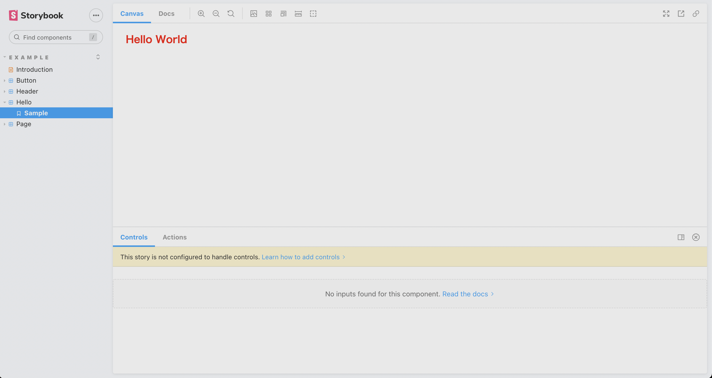

# CSS in Depth

https://github.com/CSSInDepth/css-in-depth/tree/master/ch01

## environment setup

まずはプロジェクトの初期設定を実施する。

```bash
# initialize Vite project
npm init vite@latest

# check
npm run dev

# initialize Storybook project
npx sb@next init --builder storybook-builder-vite

# check
npm run storybook
```

あとは、TypeScript 環境でも CSS Module と SASS を利用することができるように、パッケージを追加する。

```bash
# https://github.com/sass/sass
npm install --save-dev sass

# https://github.com/mrmckeb/typescript-plugin-css-modules
npm install --save-dev typescript-plugin-css-modules
```

これで以下のようなファイルを作成すれば Storybook でコンポーネントの確認を実行することができるようになる。

```bash
src/stories
├── Hello.module.scss
├── Hello.stories.tsx
└── Hello.tsx
```

- `Hello.tsx`

  ```ts
  import classes from './Hello.module.scss';

  export const Hello = () => {
    return (
      <div className={classes.hello}>
        <h1>Hello World</h1>
      </div>
    );
  };
  ```

- `Hello.module.scss`

  ```scss
  .hello {
    color: red;
  }
  ```

- `Hello.stories.tsx`

  ```tsx
  import React from 'react';
  import { ComponentMeta, ComponentStory } from '@storybook/react';

  import { Hello } from './Hello';

  export default {
    title: 'Example/Hello',
    component: Hello,
  } as ComponentMeta<typeof Hello>;

  const Template: ComponentStory<typeof Hello> = () => {
    return <Hello />;
  };

  export const Sample = Template.bind({});
  Sample.args = {};
  ```



静的解析ツールの設定を追加する。

```bash
npm install --save-dev eslint

npx eslint --init
# ❯ To check syntax and find problems
# ❯ JavaScript modules (import/export)
# ❯ React
# ? Does your project use TypeScript? › No / Yes
# ✔ Browser
# ❯ JavaScript
# ? Would you like to install them now with npm? › No / Yes

npm install --save-dev prettier eslint-config-prettier
```

各ページごとに CSS の実装を追加していく。

```bash
npm install react-router-dom
npm install --save-dev @types/react-router-dom
```
