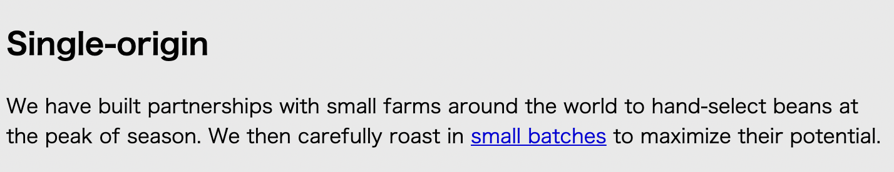

# Listing-2.13

フォントサイズの相対指定や継承されたフォントサイズを確認するために、以下のような複数のネストされた要素で構成される画面を考える。

```html
<div class="panel">
  <h2>Single-origin</h2>
  <div class="panel-body">
    We have built partnerships with small farms around the world to hand-select
    beans at the peak of season. We then carefully roast in
    <a href="/batch-size">small batches</a> to maximize their potential.
  </div>
</div>
```

CSS に何もスタイルを指定していない場合は、以下のように表示されている。


