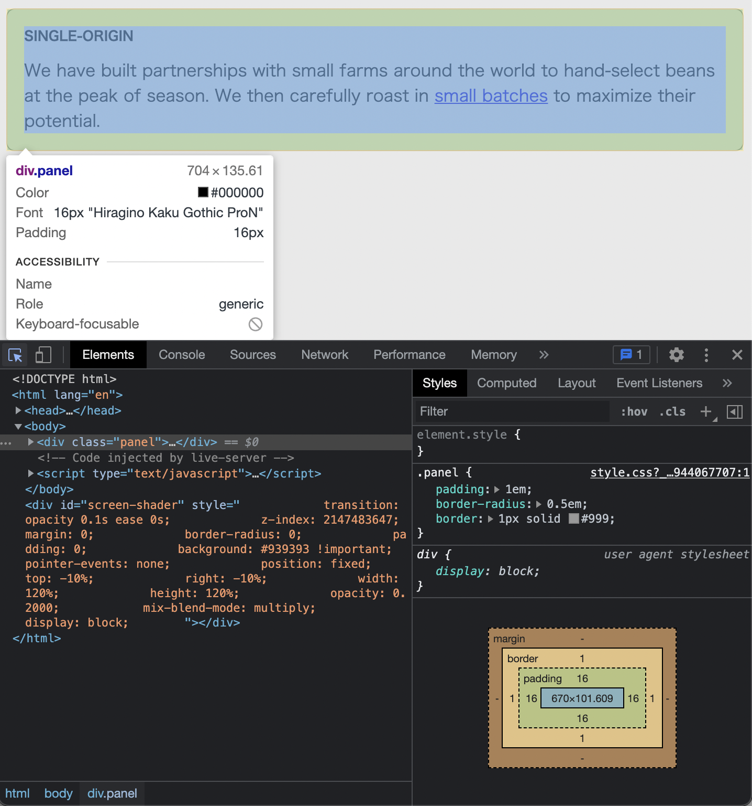

# Listing-2.14

フォントサイズの相対指定や継承されたフォントサイズを確認するために、以下のような複数のネストされた要素で構成される画面を考える。

```html
<div class="panel">
  <h2>Single-origin</h2>
  <div class="panel-body">
    We have built partnerships with small farms around the world to hand-select
    beans at the peak of season. We then carefully roast in
    <a href="/batch-size">small batches</a> to maximize their potential.
  </div>
</div>
```

ここで以下の CSS を適用する。

```css
/* .panel 全体にはルート要素のフォントサイズが継承されている */
.panel {
  /* 余白は対象の要素に継承されているフォントサイズをベースに指定できる */
  padding: 1em;
  border-radius: 0.5em;
  border: 1px solid #999;
}

.panel > h2 {
  margin-top: 0;
  /* フォントサイズはルート要素のフォントサイズを基準に 0.8倍 して値が適用される */
  font-size: 0.8rem;
  font-weight: bold;
  text-transform: uppercase;
}
```

実際にこのページを描画すると以下のようになり、余白がブラウザのデフォルトフォントサイズである `16px` が指定されていることがわかる。


