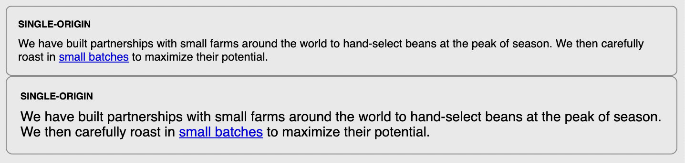

# Listing-2.17

大きなフォントサイズの設定を確認するために、以下のようにクラスで大きなフォントサイズのスタイルを指定するようにする。

```html
<div class="panel">
  <!-- ... -->
</div>

<div class="panel large">
  <!-- ... -->
</div>
```

まずは基準となるフォントサイズを指定する。これで、このスタイルを使用するコンポーネントに対して基準となるフォントサイズを指定することができる。

```css
.panel {
  /* 基準とするために、親要素としてフォントサイズをルート要素に合わせるスタイルに変更する */
  font-size: 1rem;
  padding: 1em;
  border-radius: 0.5em;
  border: 1px solid #999;
}

.panel > h2 {
  margin-top: 0;
  /* 見出しのフォントサイズは親要素を基準としたサイズに変更する */
  font-size: 0.8em;
  font-weight: bold;
  text-transform: uppercase;
}
```

あとは以下のように、親要素を基準として大きめなフォントサイズを指定できるルールを作成する。

```css
.panel.large {
  /*  */
  font-size: 1.2rem;
}
```

これでクラスを追加することで、以下のようにフォントサイズを拡大したコンポーネントを作成することができる。


