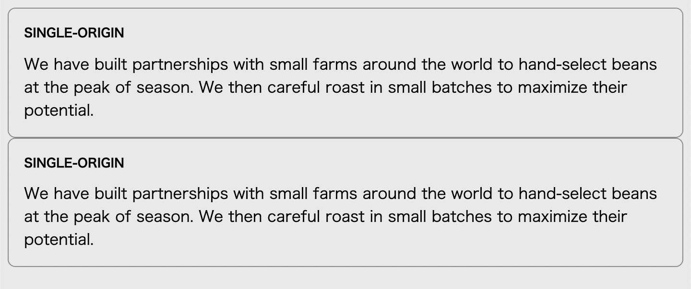

# Listing-2.28

カスタムプロパティは、セレクタ内で異なる値を同じ変数名に割り当てることも可能である。

変数の値を動的に変更して挙動を確認するために、下記の HTML を用意する。

```html
<body>
  <div class="panel">
    <h2>Single-origin</h2>
    <div class="body">
      We have built partnerships with small farms around the world to
      hand-select beans at the peak of season. We then careful roast in small
      batches to maximize their potential.
    </div>
  </div>

  <aside class="dark">
    <div class="panel">
      <h2>Single-origin</h2>
      <div class="body">
        We have built partnerships with small farms around the world to
        hand-select beans at the peak of season. We then careful roast in small
        batches to maximize their potential.
      </div>
    </div>
  </aside>
</body>
```

ここで下記のような CSS を作成し、背景色と文字色を変数で指定するようにする。

```css
:root {
  --main-bg: #fff;
  --main-color: #000;
}

.panel {
  font-size: 1rem;
  padding: 1em;
  border: 1px solid #999;
  border-radius: 0.5em;
  background-color: var(--main-bg);
  color: var(--main-color);
}

.panel > h2 {
  margin-top: 0;
  font-size: 0.8em;
  font-weight: bold;
  text-transform: uppercase;
}
```


