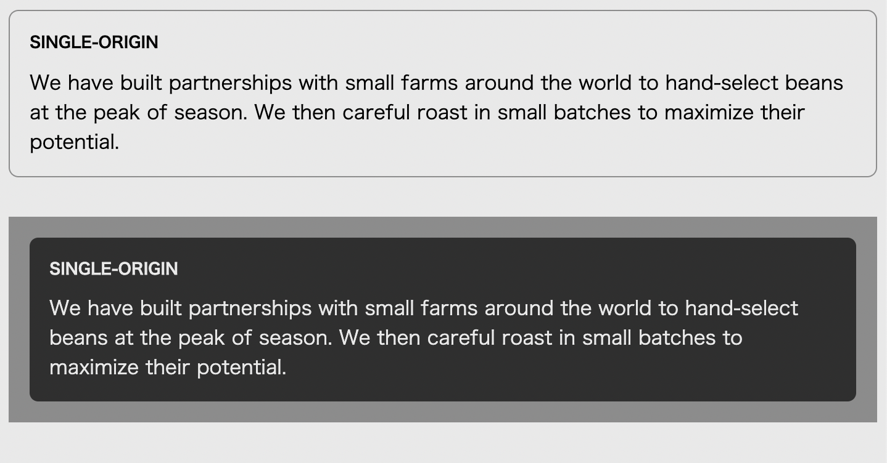

# Listing-2.29

ここで `.dark` クラスが指定されているコンテナに対しては、ルート要素で指定している背景色と文字色を変更するようにしてみる。

```html
<body>
  <div class="panel">
    <h2>Single-origin</h2>
    <div class="body">
      We have built partnerships with small farms around the world to
      hand-select beans at the peak of season. We then careful roast in small
      batches to maximize their potential.
    </div>
  </div>

  <aside class="dark">
    <div class="panel">
      <h2>Single-origin</h2>
      <div class="body">
        We have built partnerships with small farms around the world to
        hand-select beans at the peak of season. We then careful roast in small
        batches to maximize their potential.
      </div>
    </div>
  </aside>
</body>
```

次に `.dark` クラスに対応する宣言を作成し、その中ですでに定義されている変数の値を変更するようにする。

```css
:root {
  --main-bg: #fff;
  --main-color: #000;
}

.dark {
  margin-top: 2em;
  padding: 1em;
  background-color: #999;
  --main-bg: #333;
  --main-color: #fff;
}
```

これで `.dark` クラスが指定されているコンテナ内では、ルート要素で定義された変数の値とは異なる値を参照するようになるため、下記のように異なる設定で背景色と文字色が描画されることがわかる。


