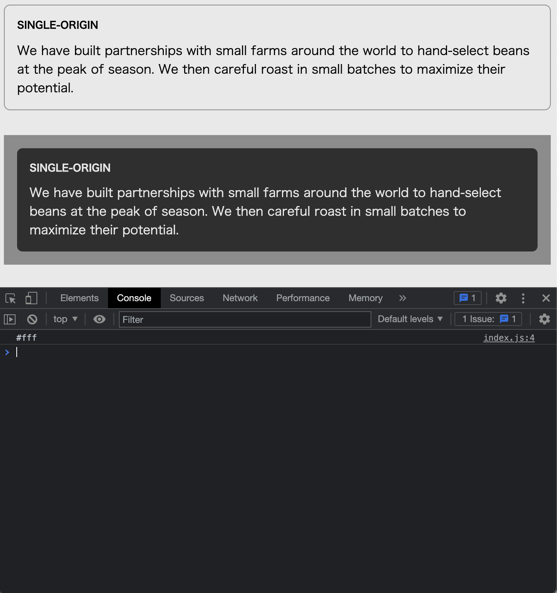

# Listing-2.30

カスタムプロパティは、JavaScript 経由で参照することも可能である。

```js
const rootElement = document.documentElement;
const styles = getComputedStyle(rootElement);
const mainColor = styles.getPropertyValue("--main-bg");
console.log(String(mainColor).trim());
```


