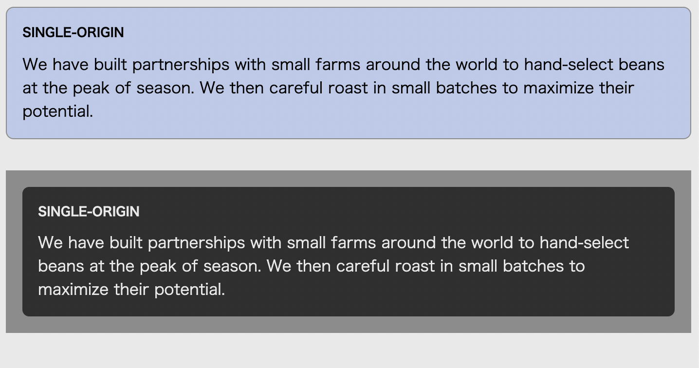

# Listing-2.31

カスタムプロパティは、JavaScript 経由で変更することも可能である。

```js
const rootElement = document.documentElement;
rootElement.styles.setProperty("--main-bg", "#cdf");
```

こうすることで、ブラウザ上で動的に変数を変えることで、設定されている背景色や文字色を変更することが可能となる。


