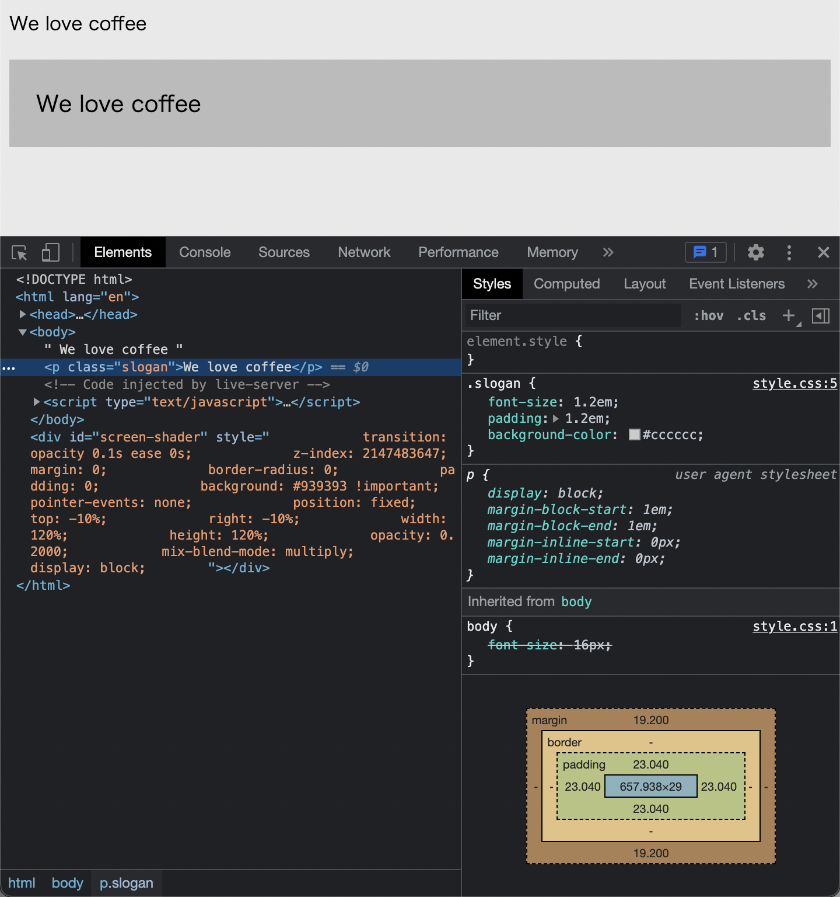

# Listing-2.6

`em` はフォントサイズと余白サイズなどを同時に指定する場合、異なる値が適用される点に注意が必要である。

例えば `font-size` と `padding` が両方とも指定されていた場合、先に要素のフォントサイズが計算され（`computed value`）、その後で計算されたフォントサイズを基準に余白サイズが計算される。

```css
body {
  font-size: 16px;
}

.slogan {
  /* 最初にフォントサイズが計算される */
  /* 16px * 1.2 = 19.2px */
  font-size: 1.2em;
  /* 次に計算された要素のフォントサイズを基準に計算される */
  /* 19.2px * 1.2 = 23.04px */
  padding: 1.2em;
  background-color: #cccccc;
}
```

実際に以下のように余白サイズは `19.2px` ではなく `23.04px` と計算されている。


