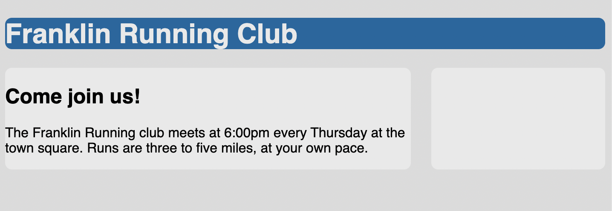

# Listing-3.10

`table-cell` では `margin` を指定することができないため、専用のプロパティである `border-spacing` を使用する。

```css
.container {
  display: table;
  width: 100%;
  border-spacing: 1.5em 0;
}
```

しかし `border-spacing` ではテーブルの外側の領域に対しても余白が適用されてしまうため、左右の幅が会わなくなってしまう。


そこで全体を新たに `div` でラッピングし、負の値を使用する外側の余白を設定することで、打ち消すことが可能となる。

```css
.wrapper {
  margin-left: -1.5em;
  margin-right: -1.5em;
}
```

これで外側の余白を打ち消すことができ、想定通りの横幅でコンテナを再現することができた。



現在では他の手法もブラウザはサポートされているが、HTML のテーブル属性である `colspan` や `rowspan` も同等のものがなく、`float` や `flexbox` などを使用すればテーブルではできないレイアウトを実現することも可能となる。
