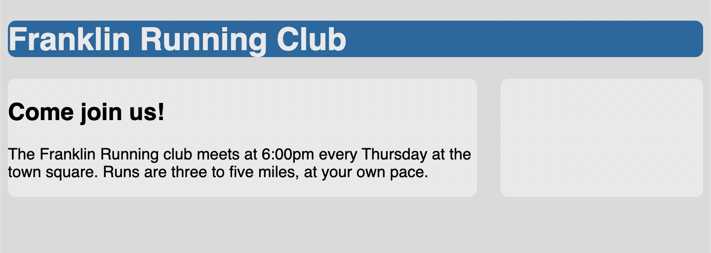
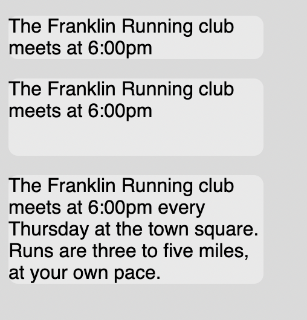

# Listing-3.11

## Flexbox での高さの制御

`flexbox` を使用すればデフォルトで同じ高さの要素を生成できるため、テーブルで使用された `wrapper` コンポーネントを使用する必要がなくなる。

```css
.container {
  display: flexbox;
}

.main {
  width: 70%;
  background-color: #fff;
  border-radius: 0.5em;
}

.sidebar {
  width: 30%;
  padding: 1.5em;
  margin-left: 1.5em;
  background-color: #fff;
  border-radius: 0.5em;
}
```

1 つのスタイルルールを設定するだけで、同じ高さを設定することが可能となる。



## min-height と max-height

`min-height` や `max-height` を使用すれば、明示的に高さを指定することなくコンテンツの内容に応じて、自然に要素のサイズを調整することができる。

実際に `min-height: 4em` を指定した場合に、以下のように真ん中のコンテンツはその高さが自動的に調整されるのではなく、指定した `4em` 分の高さが確保されていることがわかる。


