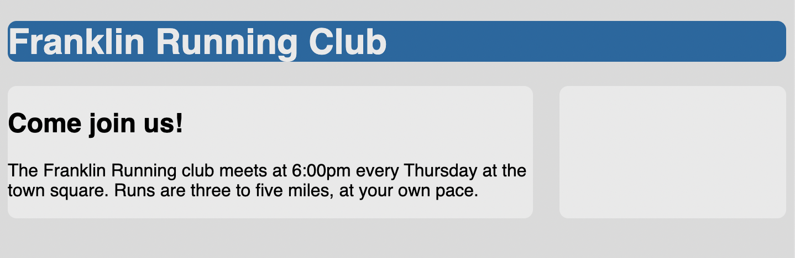
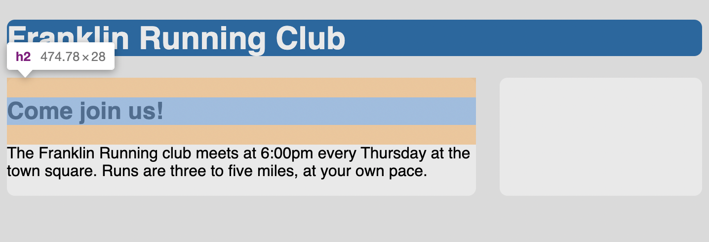
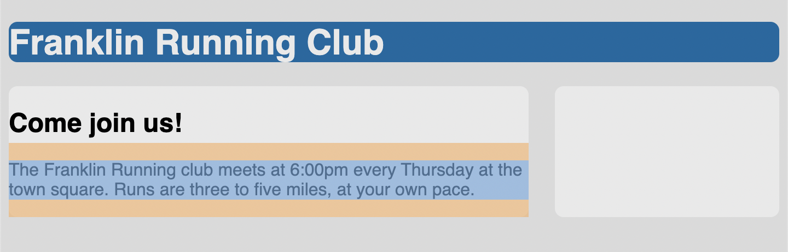

# Listing-3.13

## 負の余白

`margin` に対しては負の値を指定することが可能であり、要素を他のコンテナと重ねてみたり、広げたりする場合に使用することができる。

ただし要素を重ねた場合にはクリックできない要素として描画されてしまう可能性があるため注意が必要である。

## 余白の崩壊

今描画されているページを確認すると、ヘッダー部分とコンテナ部分に余白が設定されていることがわかる。



これは上下の余白が隣接している場合に、重なり合った結果として 1 つの余白として識別され、これを **collapsing** と呼ばれている。

|               header                |              paragraph              |
| :---------------------------------: | :---------------------------------: |
|  |  |

パラグラフにはデフォルトで `1em` の上下の余白が設定され、ヘッダーの上下の余白には `0.83em` の上下の余白が設定されている。

**collapsing** では、重なっている余白のうち大きい方が採用されるため、ヘッダーの余白（`24px * 0.83em = 19.92px`）とパラグラフの余白（`16px * 1em = 16px`）ではヘッダの余白の方が大きいため、ヘッダの余白が実際には適用されていることがわかる。

これはたとえ以下のように `div` を使用したブロック要素であっても同じであり、重なっている余白は先ほどと同じように **collapsing** が発生する。

```html
<main class="main">
  <h2>Come join us!</h2>
  <div>
    <p>
      The Franklin Running club meets at 6:00pm every Thursday at the town
      square. Runs are three to five miles, at your own pace.
    </p>
  </div>
</main>
```

上記の例では、`h2` 要素と `p` 要素と `div` 要素の該当する余白が潰されていることがわかる。

> 上下の余白は重なっている場合には潰されるが、左右の余白は重なっていても潰されない

こうすることで、上下に表示されている内容を意識することなく、様々な要素に余白のスタイルを設定することができるようになる。
