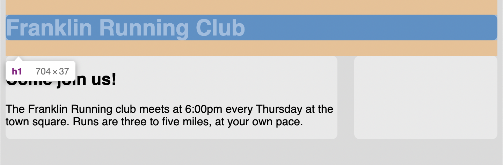
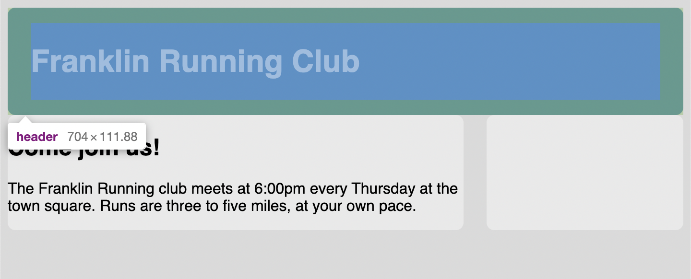

# Listing-3.14

要素の `margin` がコンテナの外側に出てしまうと、コンテナに背景が設定されている場合には画面が予期しない崩れ方になってしまうかもしれない。

`h1` 要素の上下に発生している余白を確認してみても、ユーザーエージェントのスタイルによって `0.67em` の余白が設定されていることがわかる。



そこで下記のように上下に `padding` を設定することで、ユーザーエージェントによるデフォルトの上下の余白がなくなっていることがわかる。

```css
header {
  /* デフォルトの上下を余白を埋めるような padding を設定する */
  padding: 1em 1.5em;
  color: #fff;
  background-color: #0072b0;
  border-radius: 0.5em;
}
```

これで `h1` 要素を囲んでいる `header` 要素に対して `padding` を適用することで、`h1` 要素に適用されているデフォルトの上下の余白を残したまま、内側の余白を設定することができている。


