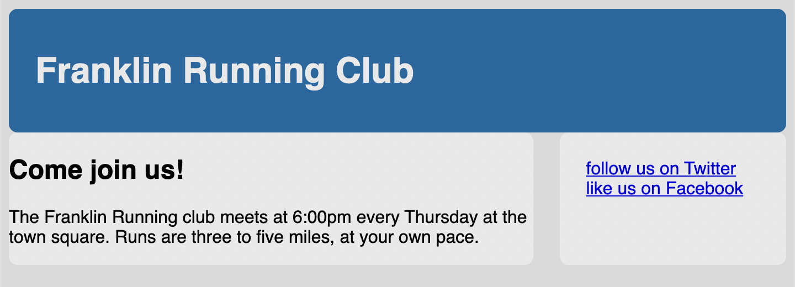

# Listing-3.15

ではサイドバーに対してリンクを付与するために、スタイルを設定せずにテキストだけを配置する。

```html
<aside class="sidebar">
  <a href="/twitter" class="button-link"> follow us on Twitter </a>
  <a href="/facebook" class="button-link"> like us on Facebook </a>
</aside>
```

これは下記のように描画される。


