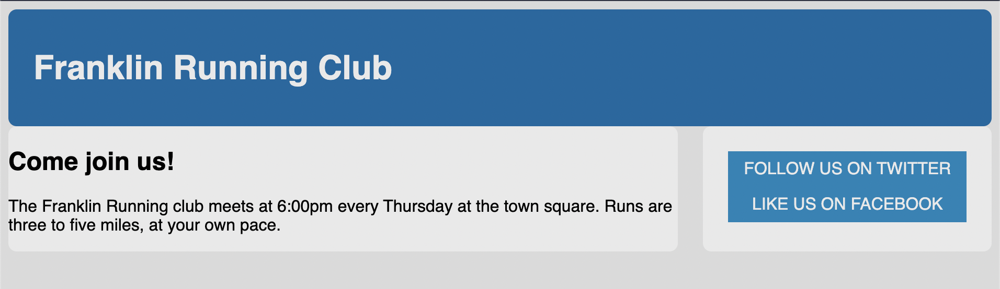

# Listing-3.16

ではサイドバーに対してリンクを付与するために、スタイルを設定せずにテキストだけを配置する。

```html
<aside class="sidebar">
  <a href="/twitter" class="button-link"> follow us on Twitter </a>
  <a href="/facebook" class="button-link"> like us on Facebook </a>
</aside>
```

これは下記のように描画される。


次に 2 つの要素が上下に並べて表示させるために、以下のように `display: block;` を指定して、改行させて表示されるようにする。

```css
.button-link {
  display: block;
  padding: 0.5em;
  color: #fff;
  background-color: #0090c9;
  text-align: center;
  text-decoration: none;
  text-transform: uppercase;
}
```

ただし、`padding` で内側の余白しか設定していないため、子要素同士の上下の余白は `0px` であり、以下のように重なって見える状態になってしまっている。


