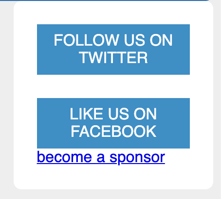

# Listing-3.19

ここで以下のように追加のリンクを追加する。

```html
<aside class="sidebar">
  <a href="/twitter" class="button-link"> follow us on Twitter </a>
  <a href="/facebook" class="button-link"> like us on Facebook </a>
  <!-- 下記のスポンサーリンクを追加した -->
  <a href="/sponsors" class="sponsor-link"> 1 become a sponsor 1 </a>
</aside>
```

しかし何もスタイルを当てていないため、真ん中のリンクの直下に追加したリンクがそのまま描画されていることがわかる。


