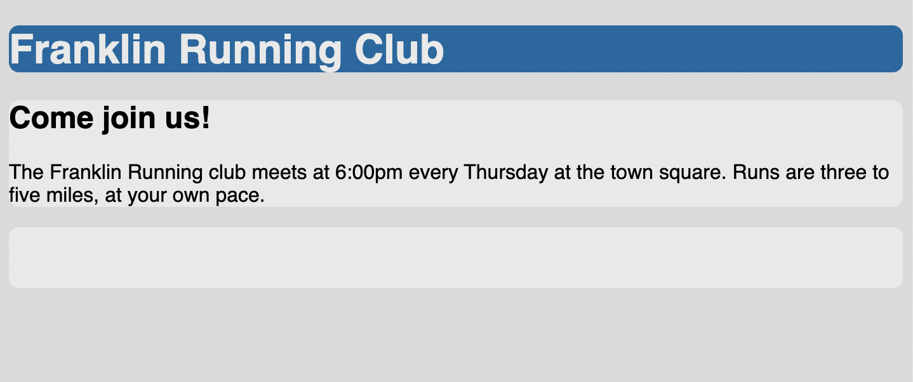

# Listing-3.2

今からは、ヘッダーと 2 カラムの要素を持つページを作成していく。

スタイルを当てるために、コンテナとなる部分にはクラスを指定しておく。

```html
<header></header>
<div class="container">
  <main class="main"></main>
  <aside class="sidebar"></aside>
</div>
```

サイトを構築する際、ページ全体の構造を決めるために背景色だけ設定しておくと、どのような枠組みにするのが良いのか考えるのに便利である。

```css
body {
  background-color: #eee;
  font-family: Helvetica, Arial, sans-serif;
}

header {
  color: #fff;
  background-color: #0072b0;
  border-radius: 0.5em;
}

main {
  /* IE では <main> タグの要素が inline と識別されてしまうバグが存在する */
  /* そのため、block になるように修正を行なっている */
  display: block;
}

.main {
  background-color: #fff;
  border-radius: 0.5em;
}

.sidebar {
  padding: 1.5em;
  background-color: #fff;
  border-radius: 0.5em;
}
```

これで以下のような初期状態が出来上がる。


