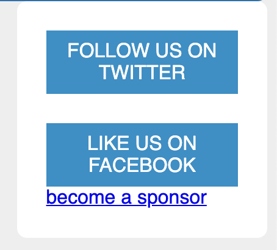
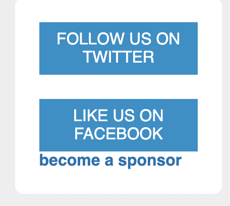

# Listing-3.20

まだ下記のようにスタイルが当たっていない状態である。



そこで他の要素と同じように、ブロック要素にした上で描画を実施する。

```css
.sponsor-link {
  display: block;
  color: #0072b0;
  font-weight: bold;
  text-decoration: none;
}
```

これで他のリンクと同じようにブロック要素にはできたが、まだ上側の余白が設定されていない状態である。


