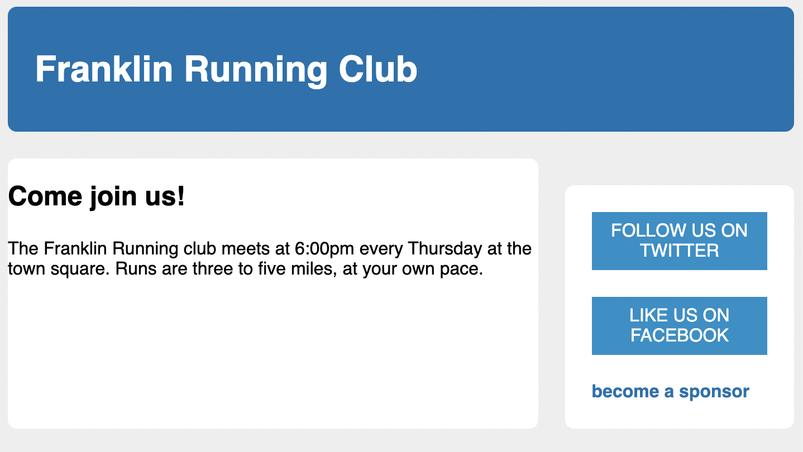

# Listing-3.21

今の状態では、真ん中の要素と一番下の要素との間には何も余白が設定されていない状態である。


以前と同じような手法でスタイルを当ててもいいが、デザイン的には現在のページ内容に合わせて `margin` を固定するのではなく、ページがどのように再構成されても機能するように修正を実施する。

今回のような場合には、**lobotomized owl** という手法を利用することが可能であり、**combinator (+)** と **Universal Selector** を使用することで、他の要素の直後にある全ての要素をターゲットにすることが可能となる。

これは現在のリンクを表示している箇所だけではなく、上記の条件を満たすあらゆる箇所で使用することが可能である。

```css
/* body 内のアイテムのみを対象とする */
body * + * {
  margin-top: 1.5em;
}
```

しかし、この場合 `main` カラムと `sidebar` カラムは隣接した要素ではあるため、下記のように 2 番目の `sidebar` にも同じく上側の余白が設定されてしまう。



そこでサイドバーやメインの余白を調整するためのスタイルを追加する。

```css
.main {
  width: 70%;
  /* 見やすくするために内側の余白を追加する */
  padding: 1em 1.5em;
  background-color: #fff;
  border-radius: 0.5em;
}

.sidebar {
  width: 30%;
  padding: 1.5em;
  /* 隣接要素に適用される margin-top: 1.5em; を消去する */
  margin-top: 0;
  margin-left: 1.5em;
  background-color: #fff;
  border-radius: 0.5em;
}
```

これで最終的に構築したかった画面を作成できた。


この方法はトレードオフの関係があり、ページ全体の多くの余白設定をシンプルにできる代わりに、適用したくない箇所では上書きする必要がある。
