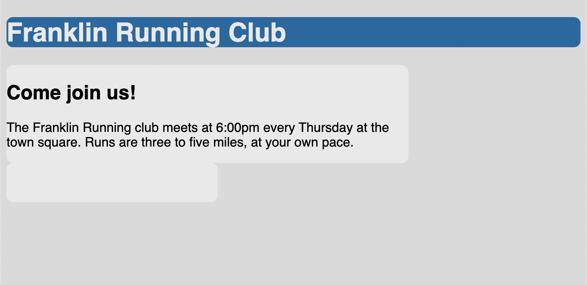
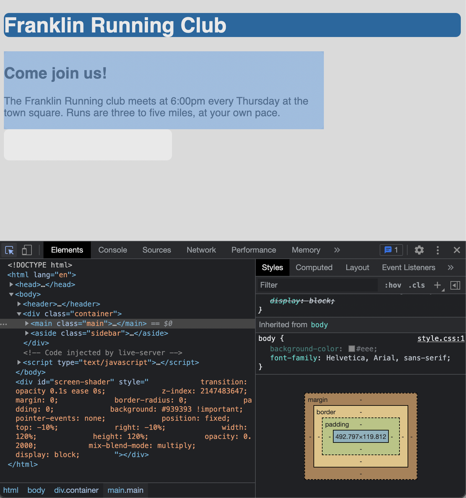

# Listing-3.3

2 カラムレイアウトを実現するために、まずは `float` ベースのレイアウトを使用して、横幅に対して `main` を 70%、 `sidebar` を 30% 占有する設定に変更する。

```css
.main {
  float: left;
  width: 70%;
  background-color: #fff;
  border-radius: 0.5em;
}

.sidebar {
  float: left;
  width: 30%;
  padding: 1.5em;
  background-color: #fff;
  border-radius: 0.5em;
}
```

ただしこのスタイルを適用しても想定通りのレイアウトにはなっていない。



この挙動になってしまう原因は、**box-model** である。

デフォルトの状態では、対象のコンテナに `width` や `height` を指定すると、要素の中身の高さや幅だけを指定したことになり、内側の余白や境界線、外側の余白はそこに追加される形となる。

実際に下記の画像でフォーカスを当てている青色の枠を確認すると、幅が `70%` となっており、その外側に `padding` や `margin` が設定されていることがわかる。



例えばコンテンツの幅が `300px` である場合、その外側に `10px` の `padding` が追加され、その外側に `1px` の `border` が追加されるため、両端を合わせて `322px` となってしまう。

そのため、コンテンツの中身の合計値が `100%` になるように設定してしまった場合、その外側に余白が追加されるため改行されてしまっている。
