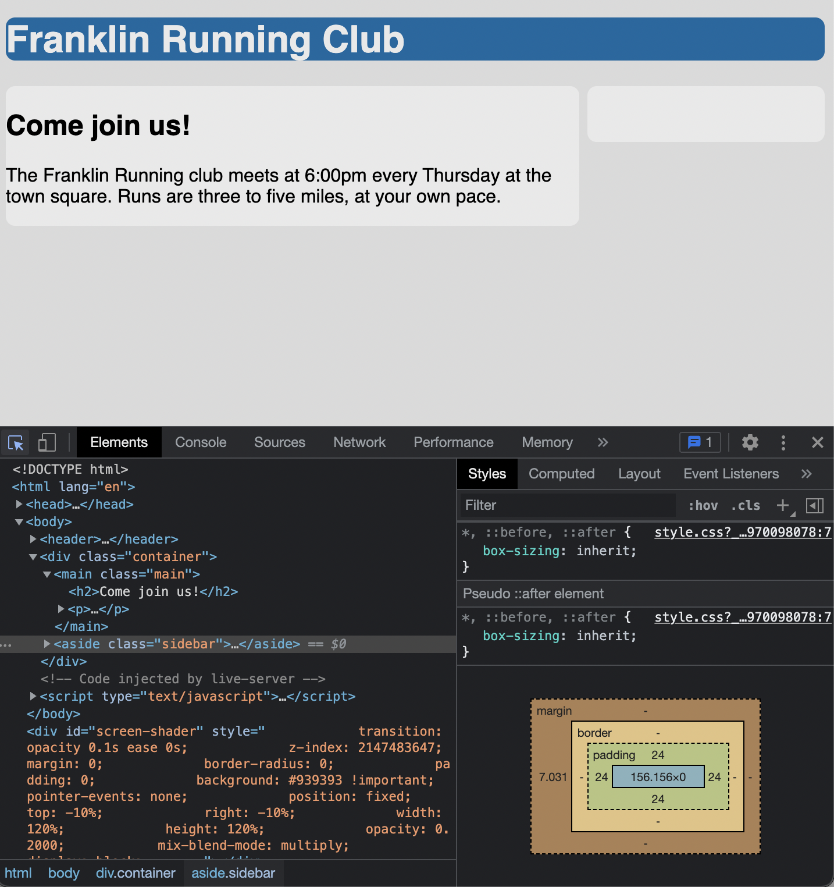

# Listing-3.7

ではコンテナ間に余白を追加してみる。

そこでまずは横幅が `100%` になるように `margin` を設定する。

```css
.main {
  float: left;
  width: 70%;
  background-color: #fff;
  border-radius: 0.5em;
}

.sidebar {
  float: left;
  /* 以下の2つの横幅の合計値が 30% になるように設定する */
  width: 29%;
  margin-left: 1%;
  padding: 1.5em;
  background-color: #fff;
  border-radius: 0.5em;
}
```

これで以下のように 2 つのカラムの間に余白を設定することが可能となった。


