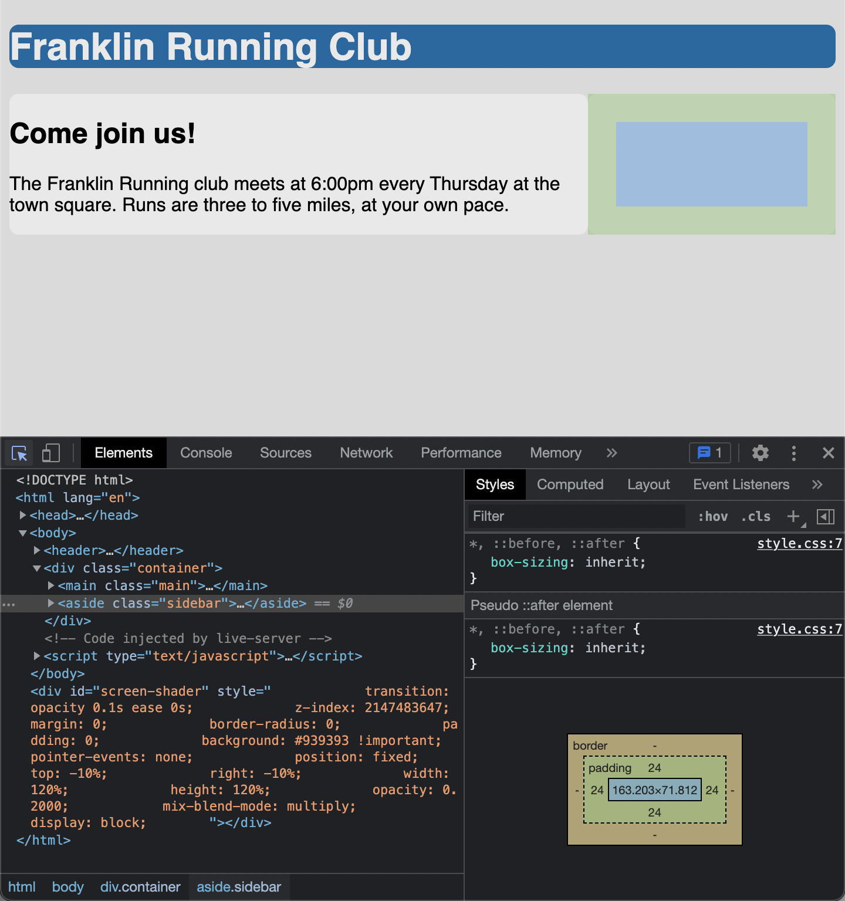

# Listing-3.9

## コンテンツがコンテナからはみ出した場合の制御

要素の高さの扱いは、幅に比べて異なっている。

通常のドキュメントフローでは、ページ上の要素のデフォルトのレイアウト動作を表している。

- インライン要素
  - ページのテキストにそって左から右へ流れる
  - コンテナの端に達すると折り返しが発生する
- ブロック要素
  - 1 つ 1 つの行に収まる
  - 上下に改行が入る

つまりコンテンツの高さは、コンテナ自体の高さではなく、コンテンツの中身によって同的に決まるため、明示的な値を設定することが難しい。

もしもコンテンツがコンテナからはみ出してしまう場合、`overflow` プロパティを使用して制御することが可能となる。

| property  | description                                                          |
| :-------- | :------------------------------------------------------------------- |
| `visible` | コンテナからはみ出してもコンテンツは表示される                       |
| `hidden`  | コンテナからはみ出したコンテンツは切り取られて表示されない           |
| `scroll`  | コンテナにスクロールバーが追加されスクロールでコンテンツを表示できる |
| `auto`    | コンテンツがオーバーフローした場合のみスクロールバーを表示する       |

しかしページ全体のスクロールとは別にネストした要素のスクロールを入れてしまうと、ユーザーに不満を抱かせてしまう可能性が存在する。

他にも長い URL のように、水平方向のオーバーフローも同じように対処することが可能であり、`overflow-x` や `overflow-y` プロパティを使用して制御することが可能である。

## コンテナの高さを合わせる

`%` は要素を含むブロックのサイズを指し示すが、そのコンテナの高さは子要素の高さによって決まるため、ブラウザが解決不可能な循環定義を発生させてしまうため、その宣言を無視してしまう。

`%` で高さを指定する場合には、明示的に親要素の高さを設定する必要がある。

一般的なデザインでは、子要素の高さを同じ高さに合わせるとより洗練された印象になるため、どちらかのコンテンツが大きくなると、それぞれのカラムも必要に応じて大きくしていき、底面が同じ高さになるようにしていく。

まずはテーブルベースのレイアウトを使用する。

そこで `display: table` をコンテナに対して使用し、子要素に対しては `display: table-cell` を指定する。

```css
.container {
  display: table;
  /* table では横幅は自動的に 100% に展開されないので明示的に指定する */
  width: 100%;
}

.main {
  display: table-cell;
  width: 70%;
  background-color: #fff;
  border-radius: 0.5em;
}

.sidebar {
  display: table-cell;
  width: 30%;
  /* table-cell では外側の余白を適用することができない */
  margin-left: 1.5em;
  padding: 1.5em;
  background-color: #fff;
  border-radius: 0.5em;
}
```

これで以下のように子要素を同じ高さに合わせることができる。


