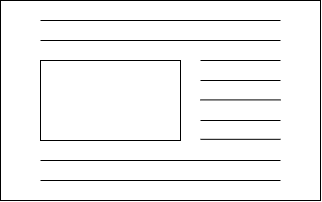
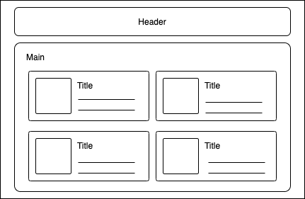
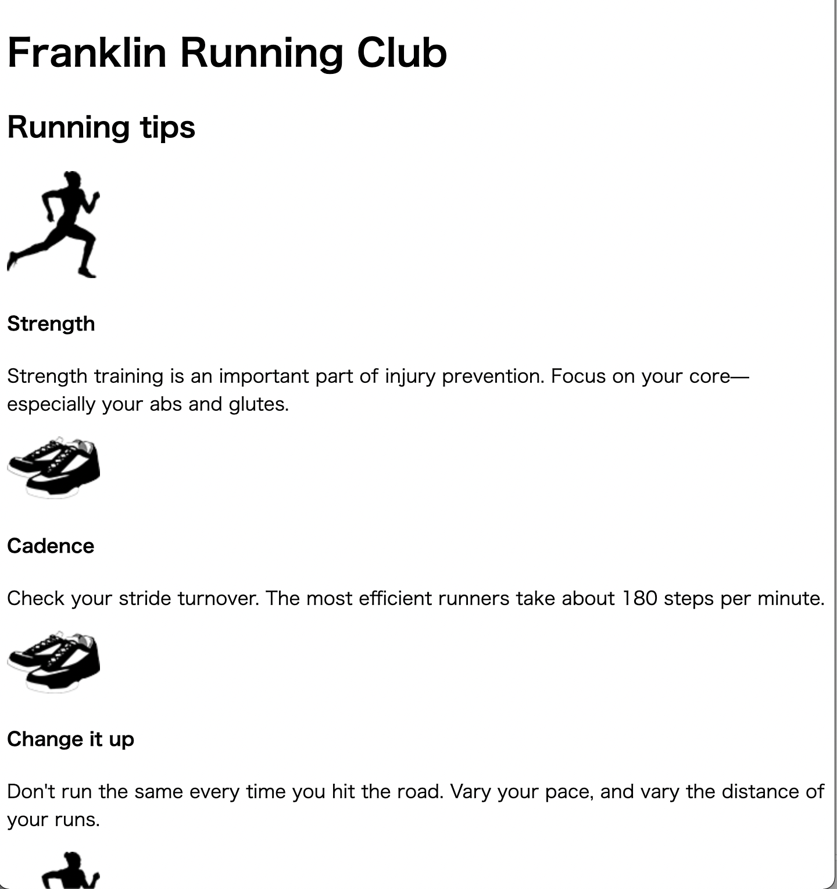

# Listing-4.1

ページのレイアウトを実装する際の 1 つの選択肢として採用される `float` は元々はレイアウトを目的としてものではなかった。

元々は、以下のように対象の要素を片側に寄せて、ドキュメントフローがその要素の周りを囲むように配置することを目的としていた。



このように元々はレイアウトを目的としてはいなかったが、セクションを移動させることができる性質を利用して、様々な種類のレイアウトを実現してきた。

ここでは下記の構造を再現することを目指す。



今回は以下のような HTML のレイアウトを実現する。

```html
<body>
  <div class="container">
    <header>
      <h1>Franklin Running Club</h1>
    </header>

    <main class="main clearfix">
      <h2>Running tips</h2>

      <div>
        <div class="media">
          
          <div class="media-body">
            <h4>Strength</h4>
            <p>
              Strength training is an important part of injury prevention. Focus
              on your core&mdash; especially your abs and glutes.
            </p>
          </div>
        </div>

        <div class="media">
          
          <div class="media-body">
            <h4>Cadence</h4>
            <p>
              Check your stride turnover. The most efficient runners take about
              180 steps per minute.
            </p>
          </div>
        </div>

        <div class="media">
          
          <div class="media-body">
            <h4>Change it up</h4>
            <p>
              Don't run the same every time you hit the road. Vary your pace,
              and vary the distance of your runs.
            </p>
          </div>
        </div>

        <div class="media">
          
          <div class="media-body">
            <h4>Focus on form</h4>
            <p>
              Run tall but relaxed. Your feet should hit the ground beneath your
              hips, not out in front of you.
            </p>
          </div>
        </div>
      </div>
    </main>
  </div>
</body>
```

この段階で以下のように 1 つ 1 つの要素が 1 行ごとに表示されているだけである。


