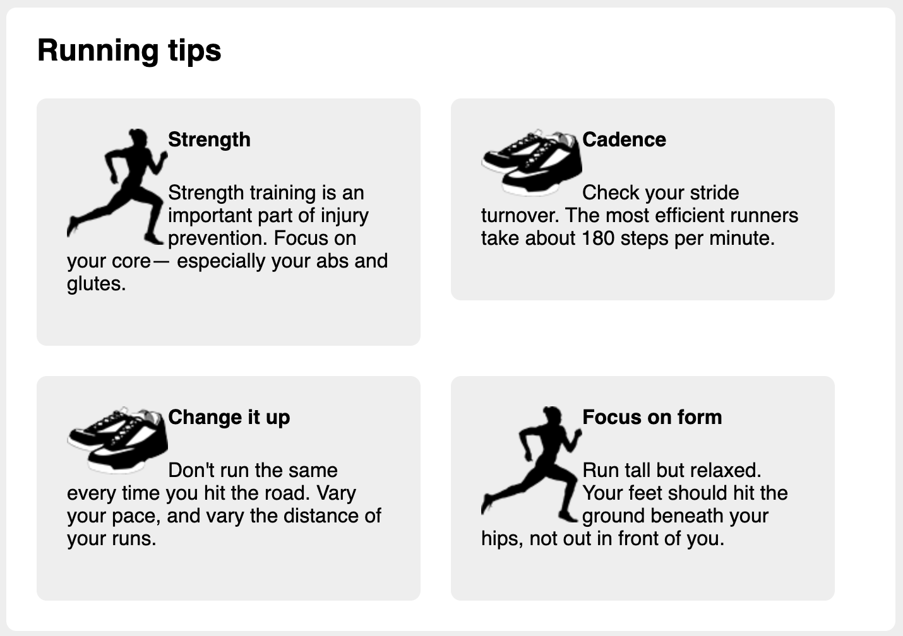

# Listing-4.10

これでメディア要素の並び順の問題は解決できたため、次にメディア要素の中身の構成を作成する。今回作成する、片側に画像を配置して、その横にテキストのブロックを配置する構成は、**media object** と呼ばれているパターンである。

改めてメディアオブジェクトの構造を確認すると以下のようになっている。

```html
<div class="media">
  
  <div class="media-body">
    <h4>Change it up</h4>
    <p>
      Don't run the same every time you hit the road. Vary your pace, and vary
      the distance of your runs.
    </p>
  </div>
</div>
```

そのため、画像をフローティング要素として取り扱うために以下のスタイルを適用する。

```css
.media-image {
  float: left;
}

.media-body {
  margin-top: 0;
}

.media-body h4 {
  margin-top: 0;
}
```

これで以下のようなメディアオブジェクトが作成された。


