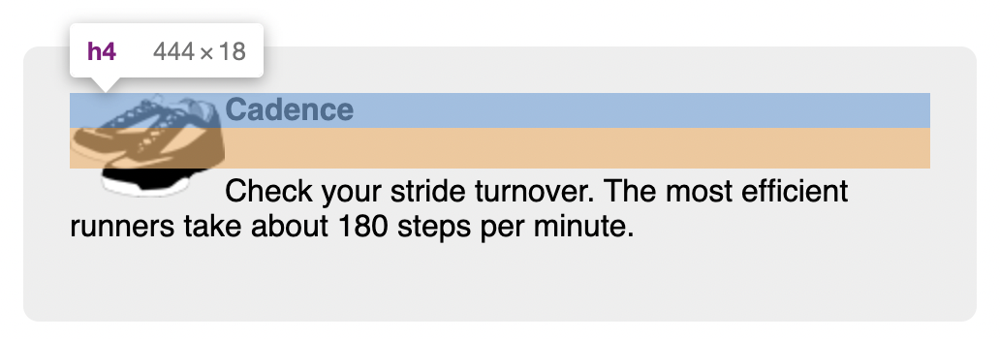
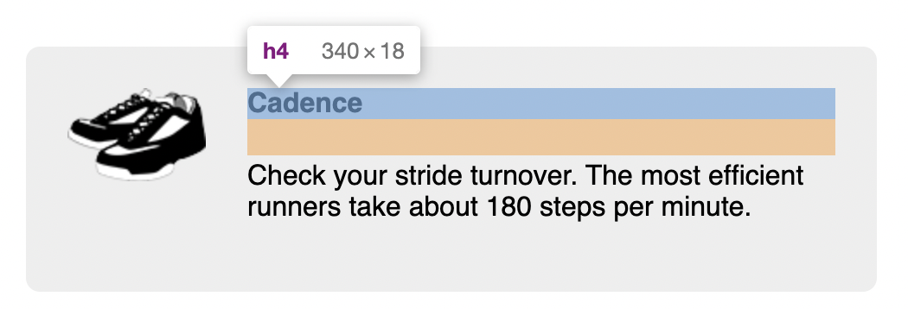

# Listing-4.11

現状のスタイルでは、下記のように画像を囲むようにテキストが配置されているため、画像の下側にさらにテキストが存在している場合には、ボックスの左側にテキストが入り込んでしまっている。



そのため、ここでは画像を左端に配置して、テキストは右端に配置するような設定を加える必要がある。

そのために **block format context (BFC)** を設定する必要がある。

BFC が確立された要素には以下の特徴がある。

1. その内部の全ての要素の上下の余白を含む
2. 全てのフローティング要素を含む
3. BFC 外のフローティング要素とは重ならない

BFC を確立するためには、以下のうちいずれかを要素に適用すればトリガーされる。

| property   | value                                                 |
| :--------- | :---------------------------------------------------- |
| `float`    | `float: left` / `float: right`                        |
| `overflow` | `hidden` / `auto` / `scroll`                          |
| `display`  | `inline-block` / `table-cell` / `flex` / `grid` / etc |
| `position` | `position: absolute` / `position: fixed`              |

この目的にあった方法でよく使用されているものは、`overflow` である。

```css
.media-image {
  float: left;
  /* 画像とテキスト間に余白を追加する */
  margin-right: 1.5em;
}

.media-body {
  /* BFC を確立させる 1つの方法 */
  overflow: auto;
  margin-top: 0;
}

.media-body h4 {
  margin-top: 0;
}
```

これで以下のように画像とテキストでそれぞれの幅を重ならないようにした状態を再現できる。



[THE MEDIA OBJECT SAVES HUNDREDS OF LINES OF CODE](http://www.stubbornella.org/content/2010/06/25/the-media-object-saves-hundreds-of-lines-of-code/)
