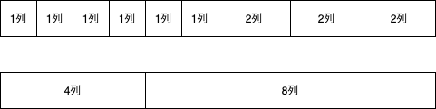
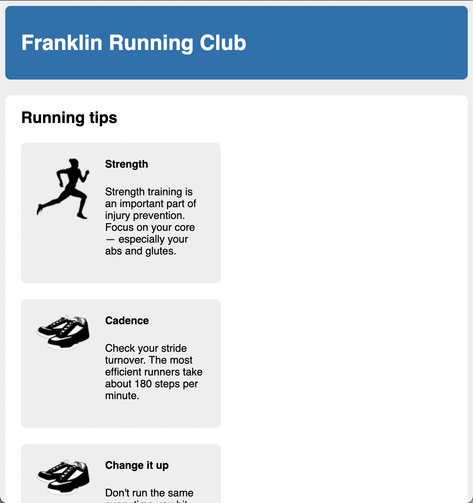

# Listing-4.12

これで 2 カラムのレイアウトを実現できたが、幅を `50%` で指定しているため、再利用性が低い状態になってしまっている。

コードを再利用するための一般的な方法の 1 つにグリッドシステムが存在しており、CSS の一連のクラス名でページの一部を行と列に変換するものである。

よく使用されるのは 2・3・4・6 で割り切ることのできる 12 列構成のグリッドシステムであり、簡単に 3 列レイアウトや 4 列レイアウトを実現でき、非対称なレイアウトも実現できる。



たとえば 2 つ目のレイアウトは以下のような構造で実現することができる。

```html
<div class="row">
  <div class="column-4">4列</div>
  <div class="column-8">8列</div>
</div>
```

ではグリッドシステムを使用した方式に変更するために、下記の HTML に変更する。

```html
<main class="main clearfix">
  <h2>Running tips</h2>

  <div class="row">
    <div class="column-6">
      <div class="media">
        
        <div class="media-body">
          <h4>Strength</h4>
          <p>
            Strength training is an important part of injury prevention. Focus
            on your core&mdash; especially your abs and glutes.
          </p>
        </div>
      </div>
    </div>

    <div class="column-6">
      <div class="media">
        
        <div class="media-body">
          <h4>Cadence</h4>
          <p>
            Check your stride turnover. The most efficient runners take about
            180 steps per minute.
          </p>
        </div>
      </div>
    </div>
  </div>
  3

  <div class="row">
    <div class="column-6">
      <div class="media">
        
        <div class="media-body">
          <h4>Change it up</h4>
          <p>
            Don't run the same every time you hit the road. Vary your pace, and
            vary the distance of your runs.
          </p>
        </div>
      </div>
    </div>

    <div class="column-6">
      <div class="media">
        
        <div class="media-body">
          <h4>Focus on form</h4>
          <p>
            Run tall but relaxed. Your feet should hit the ground beneath your
            hips, not out in front of you.
          </p>
        </div>
      </div>
    </div>
  </div>
</main>
```

まだ何もスタイルを指定していないため、下記のように 1 行に並んでいるだけである。


