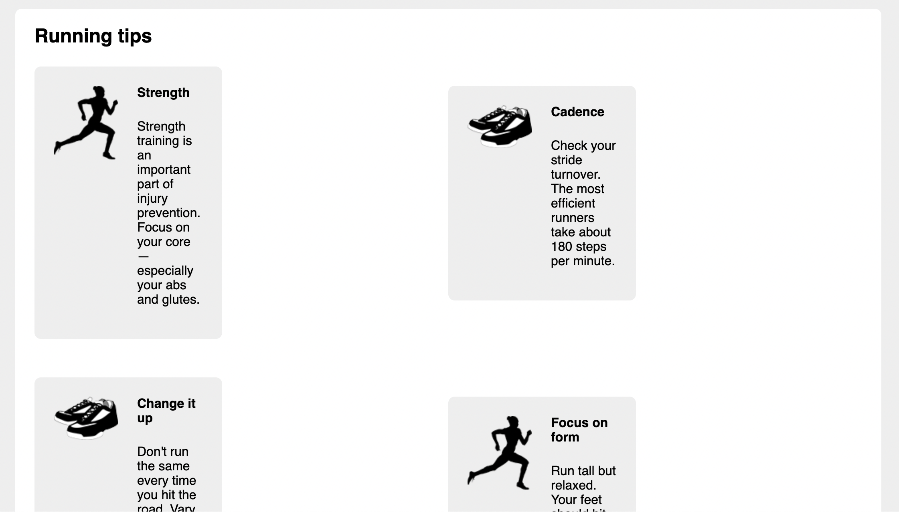

# Listing-4.14

あとはグリッドシステムに適した形でスタイルを指定する必要がある。

そこで占有する列の数とその幅を `%` で紐づけるように以下を追加する。

```css
/* ここで column-* とつくものに一律でスタイルを適用する */
[class*="column-"] {
  float: left;
}

.column-1 {
  width: 8.3333%;
}
.column-2 {
  width: 16.6667%;
}
.column-3 {
  width: 25%;
}
.column-4 {
  width: 33.3333%;
}
.column-5 {
  width: 41.6667%;
}
.column-6 {
  width: 50%;
}
.column-7 {
  width: 58.3333%;
}
.column-8 {
  width: 66.6667%;
}
.column-9 {
  width: 75%;
}
.column-10 {
  width: 83.3333%;
}
.column-11 {
  width: 91.6667%;
}
.column-12 {
  width: 100%;
}
```

ただし、現状ではメディアオブジェクトのスタイルとグリッドシステムのスタイルが重複しているため、下記のような描画になっている。


