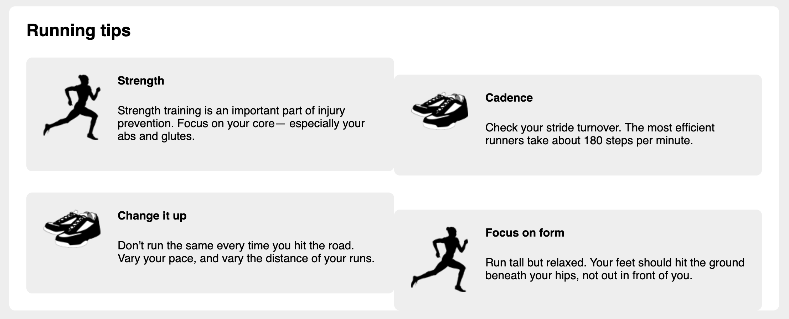

# Listing-4.15

グリッドシステム側でフローティングするようにしているため、`.media` でフローティングする必要はない。

またグリッドシステム側で行の管理と幅の調整も行なっているため、該当する箇所を既存のスタイルから削除するようにする。

```css
.media {
  /* 下記は不要なので削除する */
  /* float: left; */
  /* margin: 0 1.5em 1.5em 0; */
  /* width: calc(50% - 1.5em); */
  padding: 1.5em;
  background-color: #eee;
  border-radius: 0.5em;
}

/* 下記は不要なので削除する */
/* .media:nth-child(odd) {
  clear: left;
} */
```

これで以下のように描画される。


