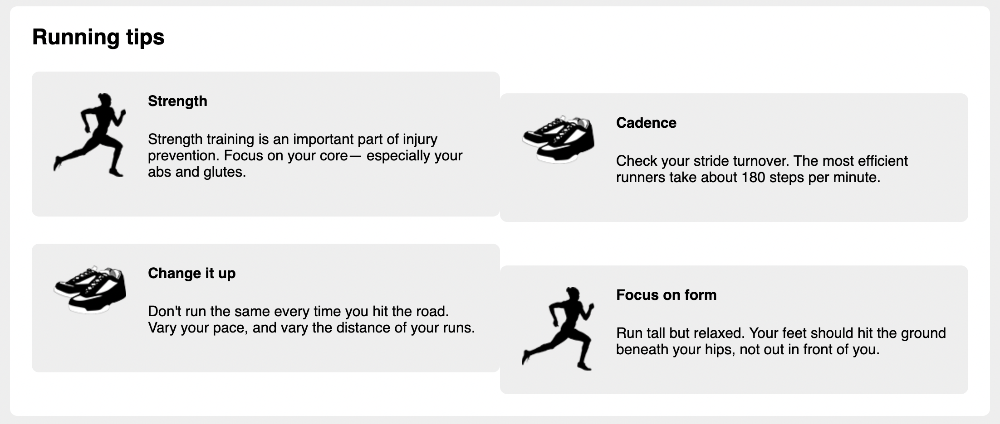

# Listing-4.16

グリッドシステムにより、`margin-bottom` 側を含む全ての余白を削除したため、メディアオブジェクトの最後の行とそのコンテナの底面にはギャップは存在しないため、コンテナの `padding` を使用して戻す。

```css
.main {
  padding: 0 1.5em 1.5em;
  background-color: #fff;
  border-radius: 0.5em;
}
```

これで下側のギャップが正しく調整することができている。


