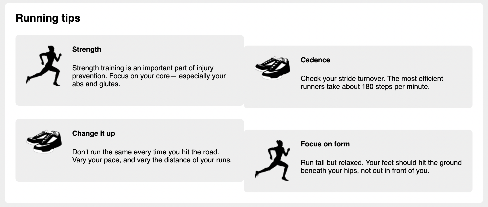
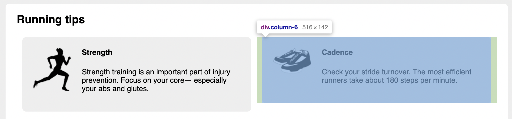

# Listing-4.17

今のままでは、各列の高さがずれてしまっているが、これは `body * + *` で指定している上側の余白が適用されてしまっているからであり、また、左右の余白もずれてしまっている。



そこで下記のように余白を上書きするように設定を追加する。

```css
[class-*="column-"] {
  float: left;
  padding: 0 0.75em;
  margin-top: 0;
}
```

これで以下のようにコンテナの左右に合計で `1.5em` 分の余白が追加されることになる。


