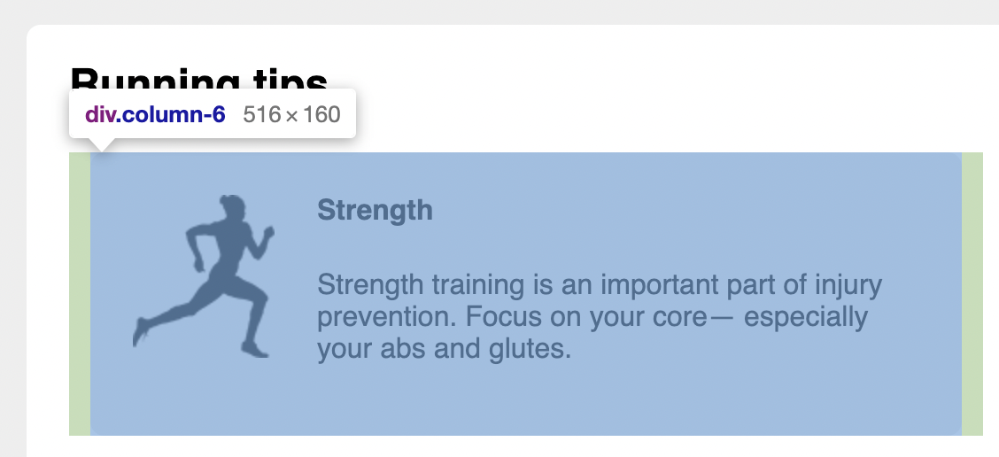
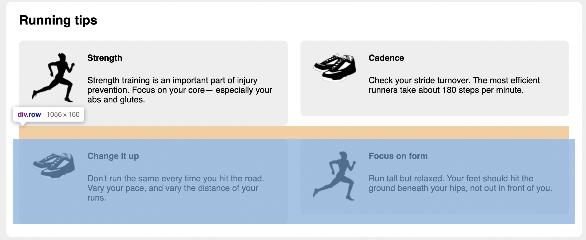

# Listing-4.18

1 行のアイテムの左右に余白を `0.75em` ずつ配置したため、`.main` 要素に配置されているタイトル部の左端と、 1 つ目のアイテムの左端がずれてしまっていることがわかる。



そこで 1 行自体の余白をマイナス方向にずらして調整する。

```css
.row {
  /* left方向のマイナス値は、左側にずらすことを意味する */
  margin-left: -0.75em;
  /* right方向のマイナス値は、右側にずらすことを意味する */
  margin-right: -0.75em;
}
```

これでアイテムの左端をタイトルに合わせることが可能となった。


