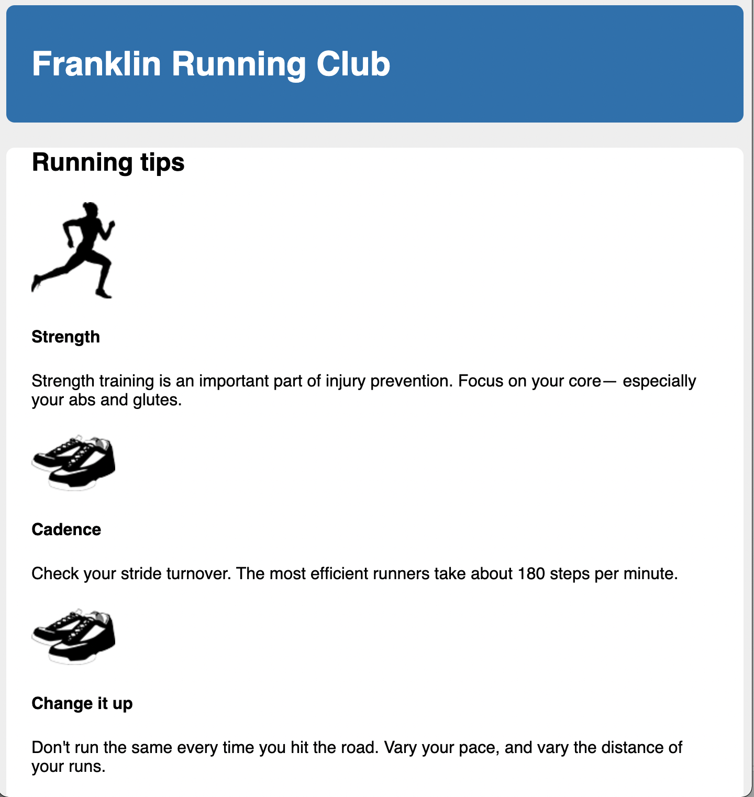

# Listing-4.1

現時点では、HTML は以下の構造になっている。

```html
<body>
  <div class="container">
    <header>
      <h1></h1>
    </header>

    <main class="main clearfix">
      <h2></h2>

      <div>
        <div class="media">
          
          <div class="media-body">
            <h4></h4>
            <p></p>
          </div>
        </div>

        <div class="media">
          
          <div class="media-body">
            <h4></h4>
            <p></p>
          </div>
        </div>

        <div class="media">
          
          <div class="media-body">
            <h4></h4>
            <p></p>
          </div>
        </div>

        <div class="media">
          
          <div class="media-body">
            <h4></h4>
            <p></p>
          </div>
        </div>
      </div>
    </main>
  </div>
</body>
```

ではこの構造に対して前回までに学習した内容の CSS を適用する。

```css
/* どの要素にも適用したい box-model への修正 */
:root {
  box-sizing: border-box;
}

*,
::before,
::after {
  box-sizing: inherit;
}

body {
  background-color: #eee;
  font-family: Helvetica, Arial, sans-serif;
}

body * + * {
  margin-top: 1.5em;
}

header {
  padding: 1em 1.5em;
  color: #fff;
  background-color: #0072b0;
  border-radius: 0.5em;
  margin-bottom: 1.5em;
}

.main {
  padding: 0 1.5em;
  background-color: #fff;
  border-radius: 0.5em;
}
```

この状態では下記のようなページが描画されているはずである。


