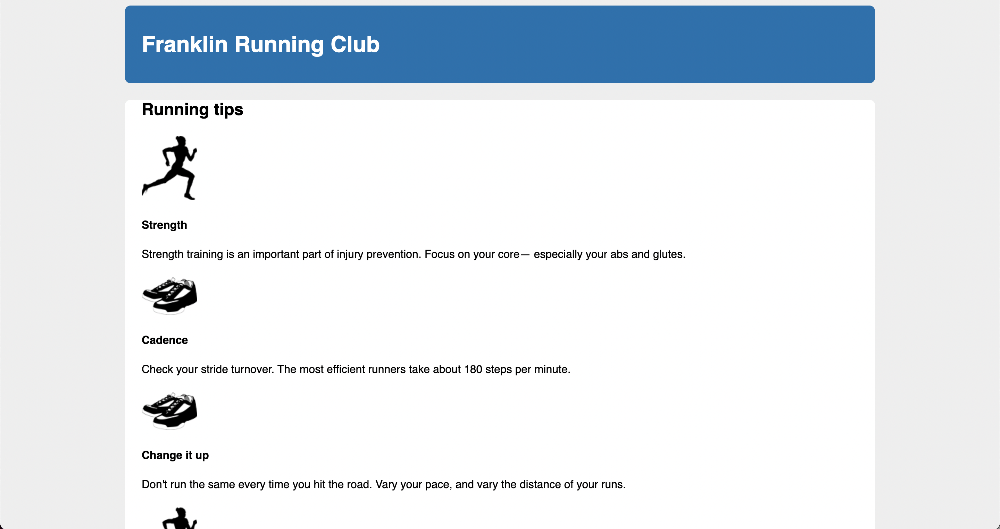

# Listing-4.3

Web ページでよく使用されているデザインは、入れ子になった 2 つのコンテナの中にコンテンツを配置して、内側のコンテナに `margin` を設定することで、外側のコンテナの中にコンテンツを配置するようにする。

これを **double container pattern** と呼ばれている。

今回の場合では、`<body>` 要素を外側のコンテナとして採用しており、デフォルトでページ幅の `100%` で描画されており、特にスタイルを設定する必要はない。

そして外側のコンテナの中に、内側のコンテナである `<div class="main clearfix">` を配置している。

```html
<body>
  <div class="container">
    <!-- コンテナ内に描画するページ -->
    <header></header>
    <div class="main clearfix"></div>
  </div>
</body>
```

では内側のコンテナに外側までの余白を設定する。この時に、`max-width` と `margin: 0 auto` を指定することで、内側のコンテナの横幅をディスプレイの解像度に関わらず最大で `1080px` として、それ以外の箇所を全て余白として自動調整することが可能となる。

```css
.container {
  /* ディスプレイの横幅が 1080px 以上、左右の余白が自動調整される */
  /* ディスプレイの横幅が 1080px 未満、横幅いっぱいにコンテナが表示される */
  max-width: 1080px;
  margin: 0 auto;
}
```

これで下記のようにディスプレイの横幅が広い場合でも、最大の幅を `1080px` に制限することが可能となった。


