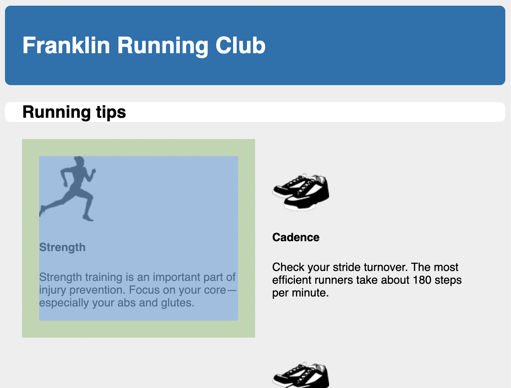
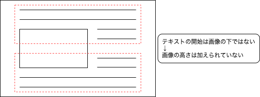

# Listing-4.4

メインコンテナに配置するメディア要素は以下のような構造になっている。

```html
<main class="main clearfix">
  <h2>Running tips</h2>

  <div>
    <!-- メディア 1つ目 -->
    <div class="media">
      
      <div class="media-body">
        <h4></h4>
        <p></p>
      </div>
    </div>

    <!-- メディア 2つ目 -->
    <div class="media">
      
      <div class="media-body">
        <h4></h4>
        <p></p>
      </div>
    </div>
  </div>
</main>
```

では `float` を使用して、親要素の横幅の `50%` の幅を指定して、コンテナに 2 カラム形式でコンテンツを配置する。

```css
.media {
  float: left;
  width: 50%;
  padding: 1.5em;
  background-color: #eee;
  border-radius: 0.5em;
}
```

このスタイルを適用すると以下のように描画される。メデイア要素は白背景のコンテナの中ではなく、その外側に配置されてしまっている。



これは `float` の本来の目的に従って、親要素に高さを加えないからである。

元々の使用目的では、下記のように画像を段落の中に組み込んで、テキストの回り込みを可能にするためのものだった。


この場合、画像の高さが段落よりも高い場合は、次の段落は最初の段落のテキストのすぐ下から始めることになる。



今回のページでも、`.main` 要素内ではページタイトル以外は全てフローティングされているため、高さが加えられることなく、白い背景の外側の領域にメディア要素が配置されている。
