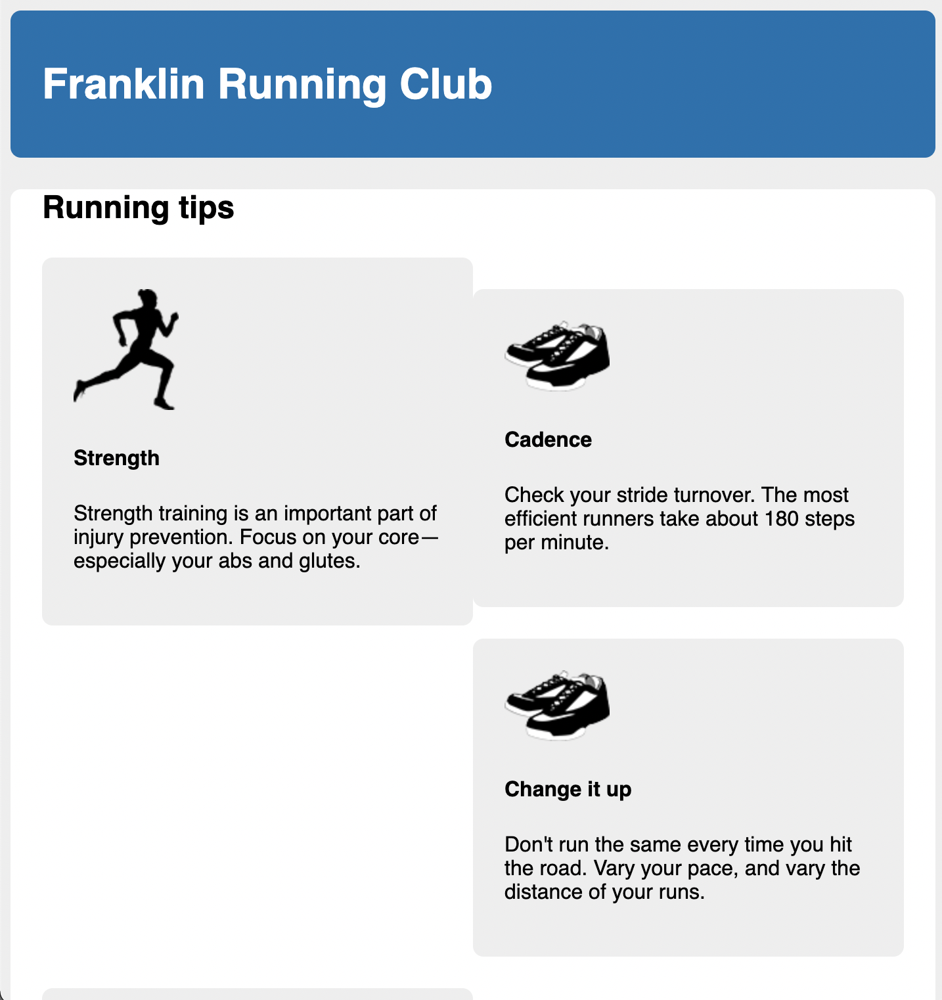

# Listing-4.6

以前は以下のように CSS ではない方法でスタイルの設定を行なっていた。

```html
<main class="main">
  <!-- ... -->
  <div style="clear: both"></div>
</main>
```

同じことを CSS で実現するには、CSS 側でフローティングされていない余分な要素を作成して、フローティング要素の下側に配置する必要がある。

このためにフローティング要素を含んでいるコンテナ自体に `::after` の擬似要素を追加して、この要素に対してスタイルを当てれば良い。

```css
.clearfix::after {
  display: block;
  /* この空文字は Opera の古いバージョンに対応するためのもの */
  content: " ";
  clear: both;
}
```

これで HTML 要素で実現した内容を、CSS で再現することができた。


