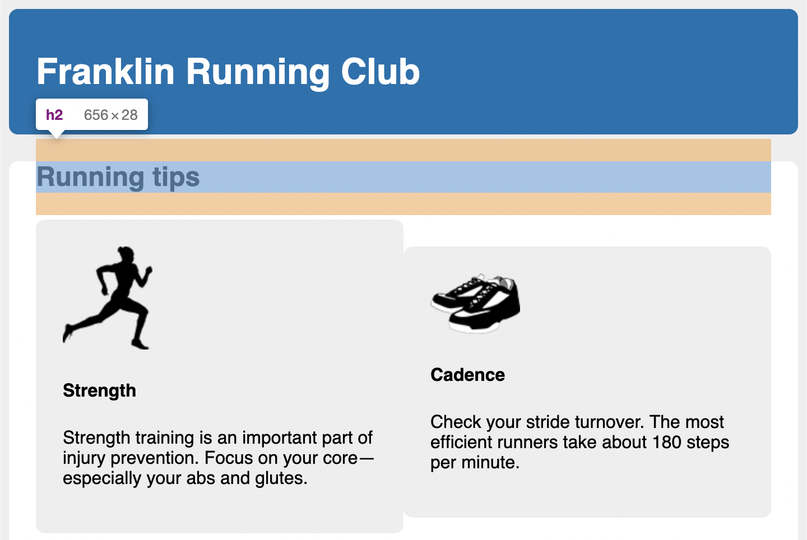

# Listing-4.7

今の状態では、`.clearfix` 要素内で使用されているヘッダーは、上側の余白がコンテナの外側にはみ出してしまっていることがわかる。



そこで以下のようなスタイルを適用する。

```css
.clearfix::before,
.clearfix::after {
  /* 子要素の margin をコンテナの上下両方に含めるようにしている */
  display: table;
  content: " ";
}

.clearfix::after {
  clear: both;
}
```

これは、`display: table` を指定した際に暗黙的に要素内に `table row` が作成され、その内部に `table-cell` が作成されることを利用している。

`margin` は `table-cell` 要素によって折り畳まれることはないので、擬似要素によっても折り畳まれることはない。

注意点は、`clear` プロパティはブロック要素に対してのみにしか適用することはできないため、`table-cell` では使用することができず、余白を含むテーブルセルを暗黙的に使用する必要がある、
