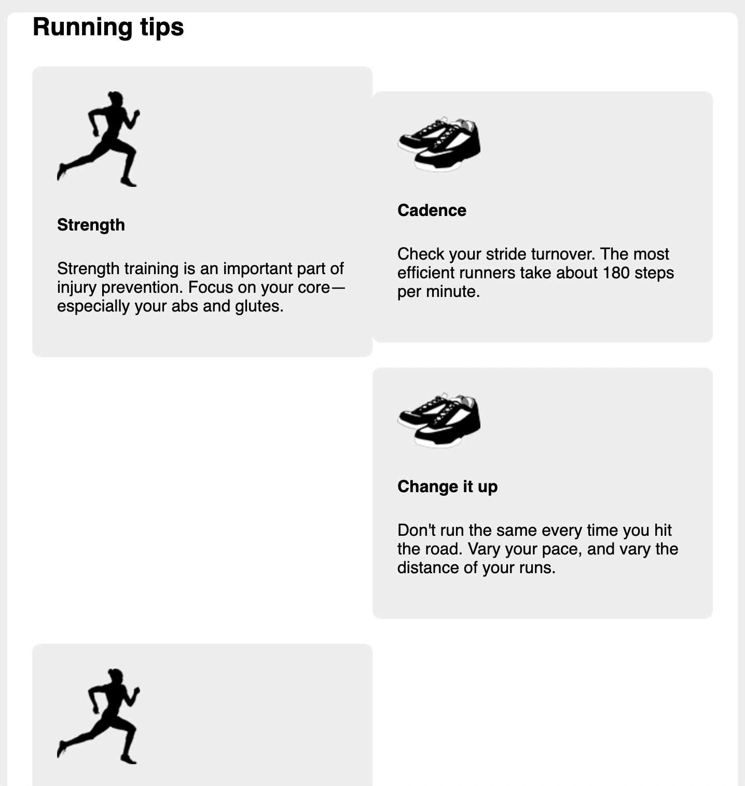
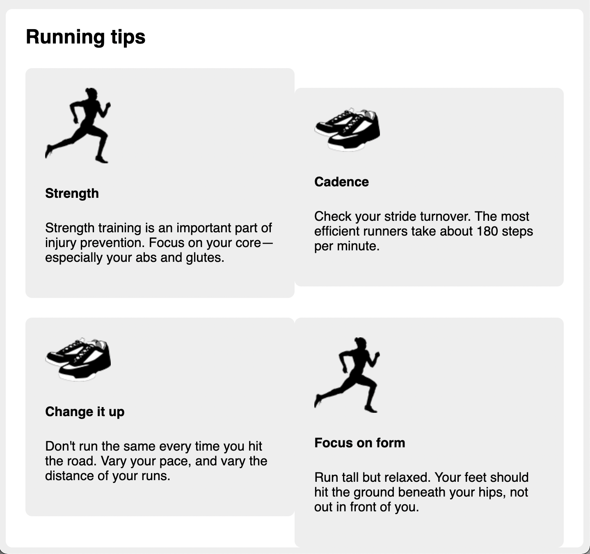

# Listing-4.8

フローティング要素の並び順を確認してみると、ブラウザが可能な限り高い位置にフロートを配置してしまうため、以下のように正しい順番で並んでいないことがわかる。



これは左上のブロック要素の高さが、右上のブロック要素の高さよりも高いために発生している問題である、

そこで 4 つのフローティング要素を個別に配置するのではなく、1 行に 2 つのフローティング要素を配置するように構造を変更する。

ここでは各行の最初の要素がその上の `float` をクリアする必要があるため、 `:nth-child` 擬似クラスを設定して、奇数のフローティング要素の場合には上の `float` をクリアする設定を追加する。

```css
.media {
  float: left;
  width: 50%;
  padding: 1.5em;
  background-color: #eee;
  border-radius: 0.5em;
}

.media:nth-child(odd) {
  clear: left;
}
```

これで以下のように想定した通りの順番でフローティング要素が描画されていることがわかる。



注意点としては、この手法は 1 行に描画される要素の数が事前に判明している場合にのみ有効な手法であり、幅が `%` で定義されている場合にはビューポートの幅に応じてアイテムの数が変化してしまうため、その他のレイアウト手法を採用する必要がある。
