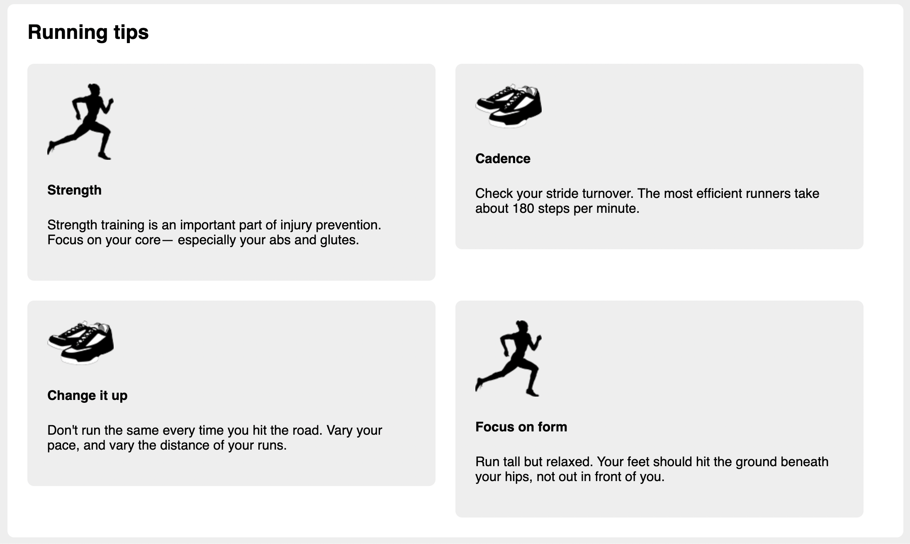

# Listing-4.9

今のままでは、各フローティング要素は余白が設定されておらず、境界線が被ってしまっている。

また今のままでは **lobotomized owl** により最初の要素を除く全ての要素に `margin-top` が適用されてしまうため、最上段の位置がずれてしまう。

そこで以下のようにメディア要素に対して改めて `margin` を指定してデフォルトで設定されている値を上書きする必要がある。

```css
.media {
  float: left;
  /* 左・下 に余白を追加する */
  margin: 0 1.5em 1.5em 0;
  /* 余白に合わせてコンテナ自体の横幅も調整する */
  width: calc(50% - 1.5em);
  padding: 1.5em;
  background-color: #eee;
  border-radius: 0.5em;
}

.media:nth-child(odd) {
  clear: left;
}
```

これで以下のように各フローティング要素の間に余白を追加することができた。


