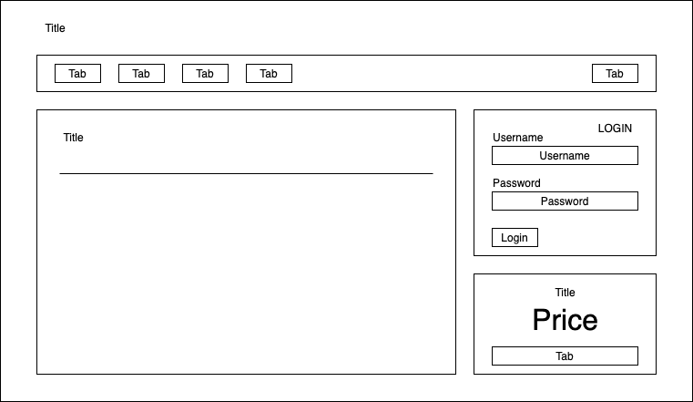

# Listing-5.1

`display: flex` を指定すると、新しく導入された **Flexbox** を利用してレイアウトを調整することが可能となる。

では Flexbox を活用して以下の画面レイアウトを作成することを目指す。



このため以下のマークアップを用意する。

```html
<!DOCTYPE html>
<head>
  <title>Flexbox example page</title>
  <link href="styles.css" rel="stylesheet" type="text/css" />
</head>
<body>
  <div class="container">
    <header>
      <h1>Ink</h1>
    </header>
    <nav>
      <ul class="site-nav">
        <li><a href="/">Home</a></li>
        <li><a href="/features">Features</a></li>
        <li><a href="/pricing">Pricing</a></li>
        <li><a href="/support">Support</a></li>
        <li class="nav-right">1 <a href="/about">About</a> 1</li>
      </ul>
    </nav>

    <main class="flex">
      <div class="column-main tile">
        <h1>Team collaboration done right</h1>
        <p>
          Thousands of teams from all over the 2 world turn to <b>Ink</b> to
          communicate 2 and get things done.
        </p>
      </div>

      <div class="column-sidebar">
        <div class="tile">
          <form class="login-form">
            <h3>Login</h3>
            <p>
              <label for="username">Username</label>
              <input id="username" type="text" name="username" />
            </p>
            <p>
              <label for="password">Password</label>
              <input id="password" type="password" name="password" />
            </p>
            <button type="submit">Login</button>
          </form>
        </div>
        <div class="tile centered">
          <small>Starting at</small>
          <div class="cost">
            <span class="cost-currency">$</span>
            <span class="cost-dollars">20</span>
            <span class="cost-cents">.00</span>
          </div>
          <a class="cta-button" href="/pricing"> Sign up </a>
        </div>
      </div>
    </main>
  </div>
</body>
```

この段階では以下のような状態で描画されている。


