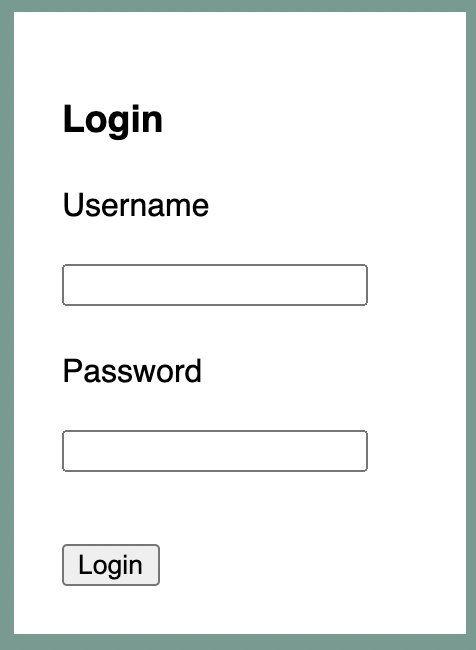
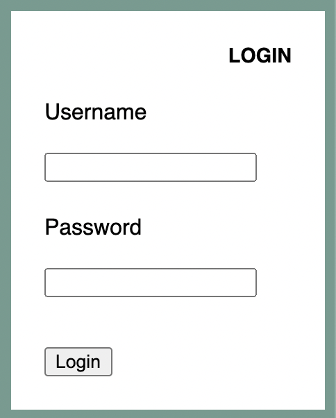
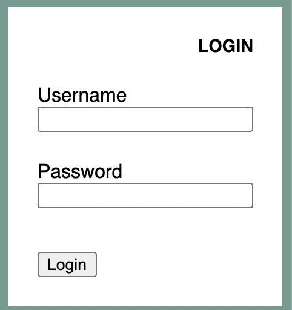
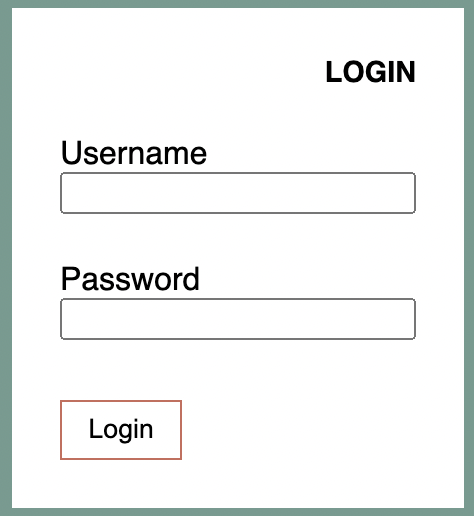

# Listing-5.10

次にログインフォームを作成していく。フォームの HTML 構造は下記のようになっている。

```html
<div class="tile">
  <form class="login-form">
    <h3>Login</h3>
    <p>
      <label for="username">Username</label>
      <input id="username" type="text" name="username" />
    </p>
    <p>
      <label for="password">Password</label>
      <input id="password" type="password" name="password" />
    </p>
    <button type="submit">Login</button>
  </form>
</div>
```

デフォルト状態では、下記のように描画されている。



まずはログインフォームの見出しについて考える。

すべきこととしては `h3` 要素にデフォルトで適用されてしまう `margin` を排除することや、テキストを右寄せにしたりする必要がある。

```css
.login-form h3 {
  margin: 0;
  font-size: 0.9rem;
  font-weight: bold;
  text-align: right;
  text-transform: uppercase;
}
```



次に入力フォームのスタイルを調整する必要がある。

ただし `input` 要素は、テキスト入力やパスワード入力だけではなく、数値やメールアドレス、日付、チェックボックスやラジオボタンなど様々な要素を併せ持っているため少し特殊である。

そこで入力形式が他と異なっているチェックボックスとラジオボタンは異なるスタイルを当てて、他の形式は同じスタイルを当てるようにする。ここでは上部のラベルと余白がない状態にすればいい。

```css
.login-form input:not([type="checkbox"]):not([type="radio"]) {
  display: block;
  margin-top: 0;
  width: 100%;
}
```

これで下記のようなスタイルを再現できた。



> 使用するものがテキスト入力とパスワード入力だけであっても、他の入力形式を意識してスタイルを当てることは重要である。

最後にボタンのスタイルを作成する。

ボタンでは表示しているテキストと境界線との余白をもう少し広げたり、デフォルトで適用されてしまう背景色や境界線を指定し直す必要がある。

```css
.login-form button {
  margin-top: 1em;
  border: 1px solid #cc6b5a;
  background-color: white;
  padding: 0.5em 1em;
  cursor: pointer;
}
```

これで目的のスタイルを再現できた。


