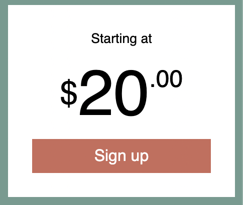
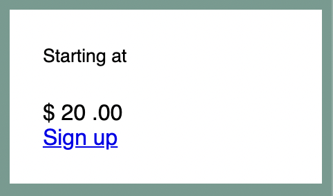
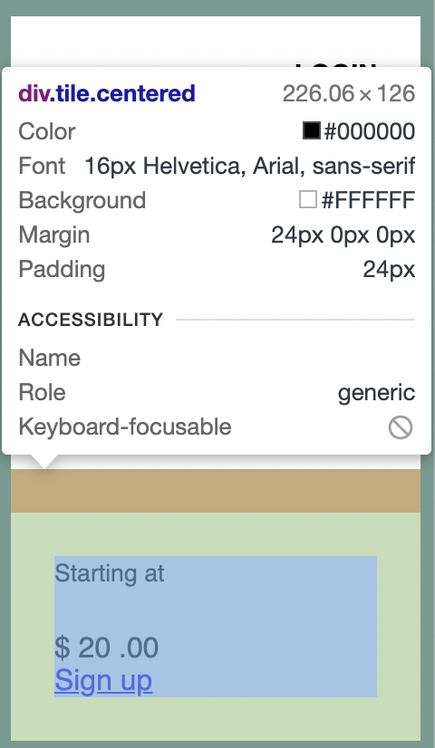
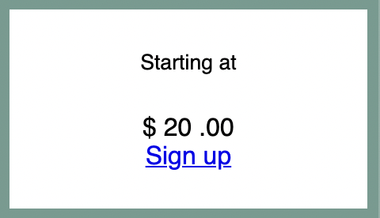
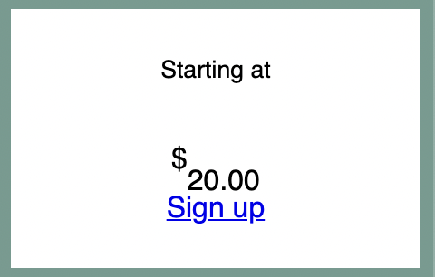
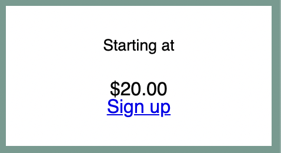
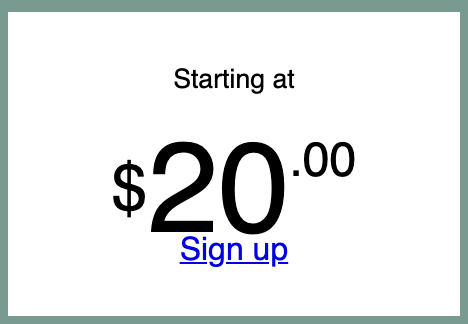
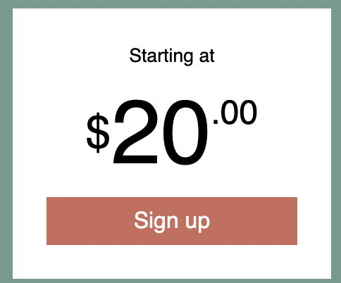

# Listing-5.11

最後に登録フォームのデザインを作成する。



以下の HTML 構造を基準とする。

```html
<div class="tile centered">
  <small>Starting at</small>
  <div class="cost">
    <span class="cost-currency">$</span>
    <span class="cost-dollars">20</span>
    <span class="cost-cents">.00</span>
  </div>
  <a class="cta-button" href="/pricing"> Sign up </a>
</div>
```

デフォルトでは下記のように描画される。



ここで改めてコンテンツの構成を確認してみると、以下のようにデフォルトではコンテンツが左端に配置されていることがわかる。



そこでブロック要素や表セルボックスの水平方向の配置を制御できる `text-align` で中心寄せにする。

```css
.centered {
  text-align: center;
}
```

これで中心寄せが完成した。



次に真ん中の価格部分のデザインを作成していくが、特徴的なのは値段の単位・値段の整数部・値段の少数部が水平方向に配置されており、少数部のみ上端に配置されていることである。

そこで各フレックスアイテム自体をコンテナの中心寄せにした上で、各フレックスアイテムの垂直方向の高さも中心寄せにする必要がある。

```css
.cost {
  display: flex;
  justify-content: center;
  align-items: center;
  line-height: 0.7;
}
```



ここでも `body * + * { margin-top: 1.5em }` が効いてしまっているため、各 `span` 要素に対して追加された余白を上書きするような設定が必要になる。

```css
.cost > span {
  margin-top: 0;
}
```



あとは文字サイズを調整していけばいいが、注意点は最後のフレックスアイテムである価格の少数部だけは、上側に配置するように設定することである。

```css
.cost-currency {
  font-size: 2rem;
}
.cost-dollars {
  font-size: 4rem;
}

.cost-cents {
  font-size: 1.5rem;
  align-self: flex-start;
}
```



最後はユーザーのクリックを促し、アクションを完遂（コンバージョン）をしてもらうための **CTA (Call-to-Action)** ボタンのスタイルを設定する。

```css
.cta-button {
  display: block;
  background-color: #cc6b5a;
  color: white;
  padding: 0.5em 1em;
  text-decoration: none;
}
```



これで目的としていたデザインを完成させることができた。
