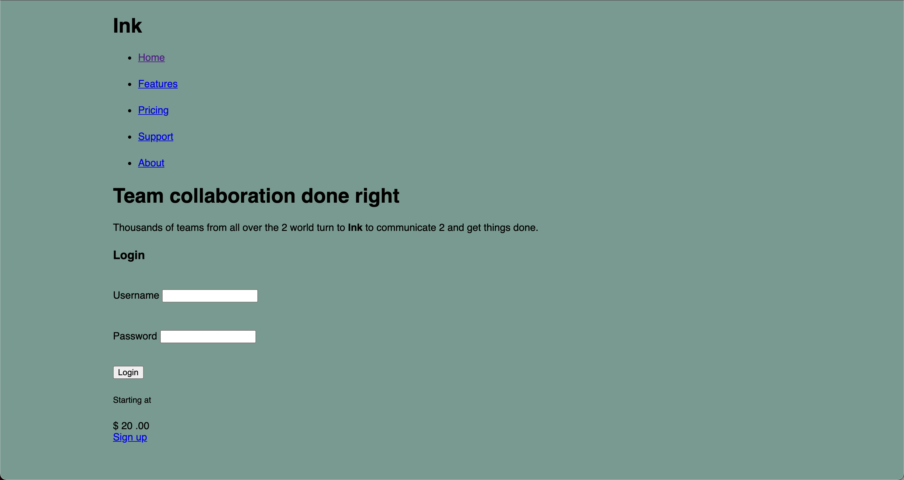

# Listing-5.2

今まで実装してきたスタイルのうち、どのページでも適用できるスタイルを追加する。

```css
:root {
  box-sizing: border-box;
}

*,
::before,
::after {
  box-sizing: inherit;
}

body {
  background-color: #709b90;
  font-family: Helvetica, Arial, sans-serif;
}

body * + * {
  margin-top: 1.5em;
}

.container {
  max-width: 1080px;
  margin: 0 auto;
}
```

これで隣接している要素の 2 番目からは上側に余白が設定されており、画面の横幅も最大で `1080px` になっていることがわかる。


