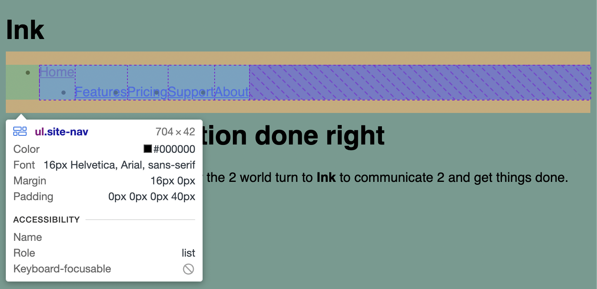
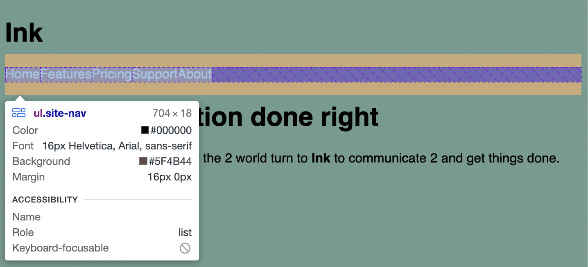

# Listing-5.3

まずは下記の HTML 構造をもとに、ヘッダー部に存在しているタブを実装しておく。

```html
<ul class="site-nav">
  <li><a href="/">Home</a></li>
  <li><a href="/features">Features</a></li>
  <li><a href="/pricing">Pricing</a></li>
  <li><a href="/support">Support</a></li>
  <li class="nav-right"><a href="/about">About</a></li>
</ul>
```

これで以下のように `display: flex;` を適用するとリスト要素がフレックスアイテムとなり、左右方向に並べられることになる。

```css
.site-nav {
  display: flex;
}
```



しかし、`<ul>` 要素を使用した際にデフォルトで適用される左側の `padding` が存在していたり、要素の 2 番目からは `margin-top: 1.5em` が適用されていたり、URL リンクに対してデフォルトのスタイルが適用されていたりする。

そこで以下のように余白の調整やデフォルトのスタイルを修正する。

```css
.site-nav {
  display: flex;
  /* リスト要素にはいくつか余白が自動的に設定される */
  /* padding-left: 40px; が自動的に付与される */
  /* margin: 1em 0; で上下の余白が自動的に付与される */
  padding-left: 0;
  /* リスト要素のデフォルトスタイルを削除する */
  list-style-type: none;
  background-color: #5f4b44;
}

.site-nav > li {
  /* body * + * { margin-top: 1.5em; } を無効化する */
  margin-top: 0;
}

.site-nav > li > a {
  /* リンク要素のデフォルトスタイルを削除する */
  background-color: #cc6b5a;
  color: white;
  text-decoration: none;
}
```

これで以下のように横並びのフレックスアイテムを再現できた。



`display: flex` などの比較的新しく追加されたプロパティは、古いブラウザはサポートしていないこともあるため、**vendor prefix** を付与する必要がある。

例えばフレックスボックスを Safari8 で使用したい場合は以下のように接頭辞をつける必要がある。

```css
.site-nav {
  /* Safari8の場合には、下記の -webkit-flex がカスケードされる値になる */
  display: -webkit-flex;
  display: flex;
}
```

ただしどういったプロパティがどのブラウザのどのバージョンに対応していないのかを調査することは面倒ではあるため、[https://github.com/postcss/autoprefixer](https://github.com/postcss/autoprefixer) のような自動的にプレフィックスをつけるようにするといい。
