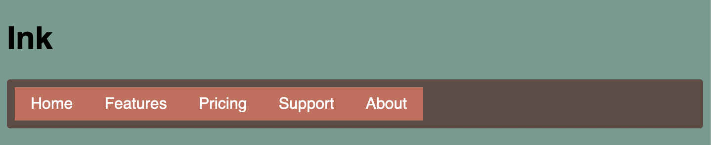

# Listing-5.4

では以下の HTML 要素を横並びにすることはできたので、余白を追加してより目標のデザインに近づけていく。

```html
<ul class="site-nav">
  <li><a href="/">Home</a></li>
  <li><a href="/features">Features</a></li>
  <li><a href="/pricing">Pricing</a></li>
  <li><a href="/support">Support</a></li>
  <li class="nav-right"><a href="/about">About</a></li>
</ul>
```

では上記のヘッダー部を、クリック可能なタブとして実装していく。

この時に注意する必要があることは、余白の追加などを `li` 要素ではなく、`a` 要素に対して実施することである。あくまでもリンクをクリックして URL が遷移する機能は `a` 要素に紐づくものであるため、`li` 要素の余白を追加するとクリック可能な領域が狭くなってしまうからである。

```css
.site-nav {
  display: flex;
  /* ヘッダーナビゲーション全体は、内側に少しだけ余白を設定しておく */
  padding: 0.5em;
  list-style-type: none;
  background-color: #5f4b44;
  border-radius: 0.2em;
}

.site-nav > li {
  margin-top: 0;
}

.site-nav > li > a {
  /* リンク要素はデフォルトでインライン要素なので注意が必要 */
  display: block;
  padding: 0.5em 1em;
  background-color: #cc6b5a;
  color: white;
  text-decoration: none;
}
```

注意点として、`a` 要素はデフォルトでインラインスタイルとなってしまい、親要素に寄与する高さが `padding` や `margin` ではなく 1 行のラインの高さになってしまうため、ブロックスタイルに変更している。


