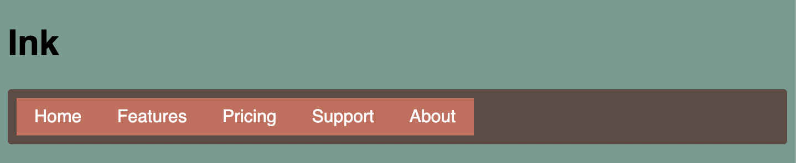
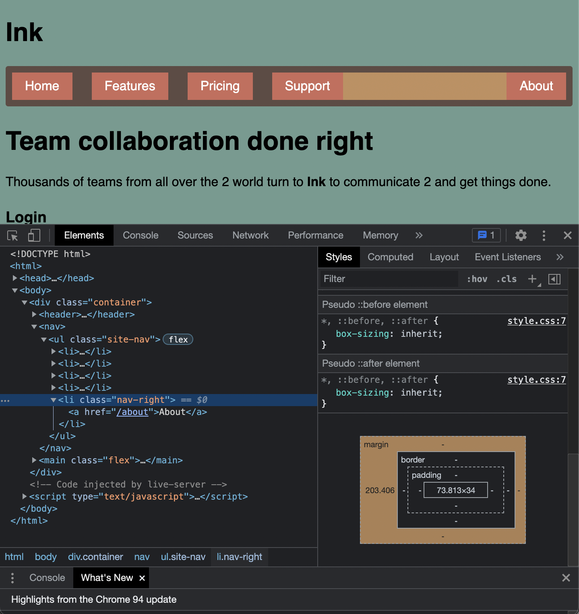

# Listing-5.5

今実現したいことは、各タブの間隔を `1.5em` 程度に調整し、サイドの要素である `About` を右端へと持っていくことである。



これは最後のフレックスアイテムに関しては、残りの余白は `margin: auto` で自動的に調整することが可能である。

そのため、下記のように最初の要素以外には左側の余白を設定し、一番右端を示すクラスには自動的な余白調整を追加することで、目的としいたデザインを作ることが可能である。

```css
.site-nav > li + li {
  margin-left: 1.5em;
}

.site-nav > .nav-right {
  margin-left: auto;
}
```


