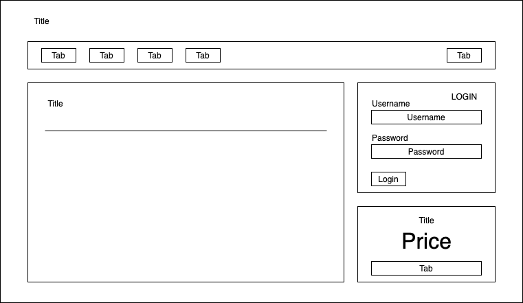
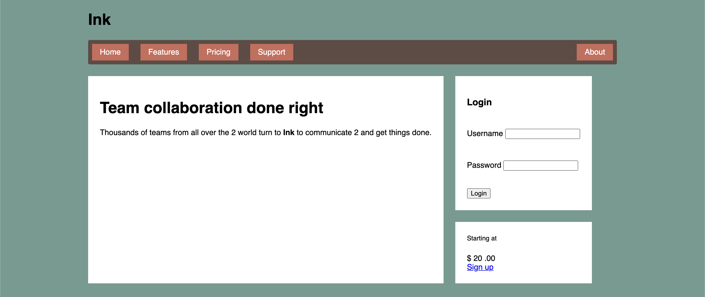

# Listing-5.6

次に以下の構造を有するメインコンテンツのスタイルを作成していく。

```html
<main class="flex">
  <div class="column-main tile"></div>

  <div class="column-sidebar">
    <div class="tile"></div>
    <div class="tile centered"></div>
  </div>
</main>
```

以下でいうヘッダー以下の領域が該当する。



ポイントとしては、`.tile` クラスで実際にコンテンツを有しているコンテナを示しており、今回はフレックスボックス以下のフレックスアイテムが、メインコンテンツのカラムとサイドバーのカラムという、カラム方向のフレックスアイテムであるという点である。

まずはフレックスボックスとしてスタイルを作成する。

```css
.flex {
  display: flex;
}

.flex > * + * {
  /* メインカラム と サイドバーカラムは上辺の高さは一致しており、左右の余白が存在する */
  margin-top: 0;
  margin-left: 1.5em;
}

.tile {
  padding: 1.5em;
  background-color: #fff;
}
```

これで右端にフレックスボックスに起因する余白が存在しているが、おおよその画面構成は再現できるようになった。


