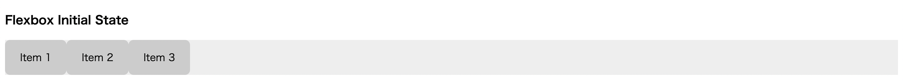
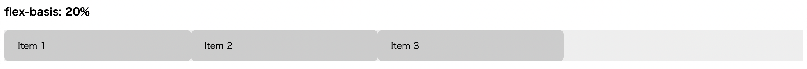
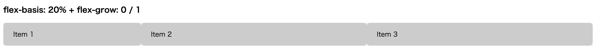
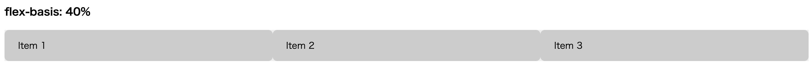
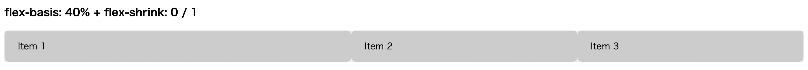
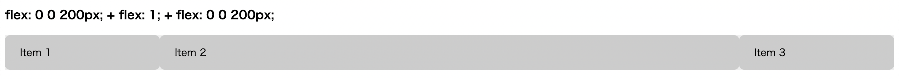

# Listing-5.7-flex-sizing

ここではフレックスアイテムで使用できるサイジングプロパティの挙動を確認する。

ベースとして下記の HTML を使用する。

```html
<h3>Flexbox Initial State</h3>
<div class="container">
  <div class="flex-item">Item 1</div>
  <div class="flex-item">Item 2</div>
  <div class="flex-item">Item 3</div>
</div>
```

まずは全体をフレックスコンテナとして認識させ、プロパティの違いによる挙動が理解できるように背景色を設定しておく。

```css
.container {
  display: flex;
  background-color: #eee;
}

.flex-item {
  padding: 1em 1.5em;
  border-radius: 0.5em;
  background-color: #ccc;
}
```

この状態では下記のように描画され、アイテムのコンテンツの内容に応じて幅を自動的に確保し、右側の余白はそのままの状態になっていることがわかる。



## flex-basis

基本的にはどのプロパティも、要素のサイズの出発点、つまり初期の「メインサイズ」を定義し、メインサイズに合わせて相対的に幅を変化させる性質を持っている。

`flex-basis` では `px` や `em` や `%` などの幅に適用できるあらゆる値を設定できる。初期値は `auto` が適用されている。

例えば以下のような設定を追加する。

```css
.basis-item1 {
  flex-basis: 20%;
}

.basis-item2 {
  flex-basis: 20%;
}

.basis-item3 {
  flex-basis: 20%;
}
```

こうすると以下のようにフレックスアイテムは、親要素の幅に対してそれぞれ `20%` ずつ確保され、余った `40%` 部分がそのまま残ってしまっていることがわかる。



ここで `flex-basis` のサイズが決定した後、余白の部分に対して、どのようにフレックスアイテムを拡大・縮小させるのかは、それぞれ `flex-grow` と `flex-shrink` プロパティで制御する。

## flex-grow

`flex-grow: 0` が設定されたアイテムは、計算された `flex-basis` を超えて拡大されることはなく、0 以外の値であれば、値の比率に合わせて残りの部分を埋めるようにアイテムを拡大させる。

ここで各アイテムに対して、以下の値を適用する。

```css
/* flex-grow */
.grow-item1 {
  flex-grow: 0;
}

.grow-item2 {
  flex-grow: 1;
}

.grow-item3 {
  flex-grow: 1;
}
```

こうすれば `0` のアイテムは拡大されておらず、`1` のアイテムは残りのスペースを埋めるように均等に拡大されていることがわかる。



> `flex-grow`, `flex-shrink`, `flex-basis` は個別に指定するものではなく、省略形である `flex` が好んで使用される。
>
> 省略した場合には、`flex-grow: 1`, `flex-shrink: 1`, `flex-basis: 0%` が自動的に適用される。

## flex-shrink

`flex-shrink` はフレックスアイテムがコンテナからオーバーフローしてしまった時に、各アイテムをどのように縮小させるのかを決定する。

例えば各アイテムに `flex-basis: 40%` を設定して、コンテナからオーバーフローしてしまう状態にしたフレックスボックスを描画すると、下記のように各アイテムは均等に配置されてしまう状態になる。



`flex-shrink` では、値を `0` に指定したアイテムは縮小することはなくなり、値が 0 以上のアイテムは、その値に比例して縮小される。

そのため最初のアイテムに `flex-shrink: 0` を設定し、2 番目と 3 番目のアイテムに `flex-shrink: 1` を設定した場合には、下記のように最初のアイテムは `flex-basis: 40%` から縮小されることはないが、他のアイテムは残りの幅に合わせて均等に縮小されていることがわかる。



## 実践的な活用例

アイテムのメインサイズを決める `flex-basis` とアイテムの拡大・縮小を行う `flex-grow` や `flex-shrink` を使用することで柔軟なレイアウトを実現できる。

例えば以下のように両端は固定幅にした上で、中央のカラムはコンテンツに合わせて動的に変化するような 3 カラムレイアウトを実現することができる。


