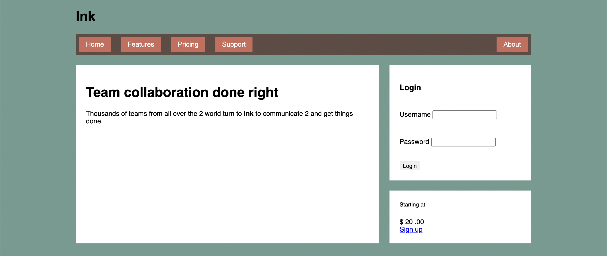

# Listing-5.7

ここまででフレックスボックスを使用して、メインコンテンツとサイドバーの 2 カラムレイアウトを実現することができた。

```html
<main class="flex">
  <div class="column-main tile"></div>

  <div class="column-sidebar">
    <div class="tile"></div>
    <div class="tile centered"></div>
  </div>
</main>
```

今のフレックスボックスでは、2 つのカラムは幅を何も指定していないため、コンテンツに応じて自然にサイズが決まるようになっているため、メインコンテンツカラムが全体の `2 / 3`、サイドバーが全体の `1 / 3` になるように設定を追加する。

このようにフレックスアイテムに対して、どの程度の幅の割合を占有させるのか決めるには、フレックスアイテムに `flex` プロパティを使用して、占有割合を指定すればいい。s

```css
.column-main {
  flex: 2;
}

.column-sidebar {
  flex: 1;
}
```

こうすると以下のように全体の幅に対してそれぞれのアイテムの幅の割合を指定することができる。



なお `flex` プロパティは、以下の 3 つのサイジングプロパティの省略形である。

| property      | default |
| :------------ | :------ |
| `flex-grow`   | `2`     |
| `flex-shrink` | `1`     |
| `flex-basis`  | `0%`    |

つまり以下の 2 つのルールセットは同じ意味なる。

```css
.flex-sizing-abr {
  /* <flex-grow> <flex-shrink> <flex-basis> */
  flex: 2;
}

.flex-sizing {
  flex-grow: 2; /* ここだけに影響する */
  flex-shrink: 1;
  flex-basis: 0%;
}
```
