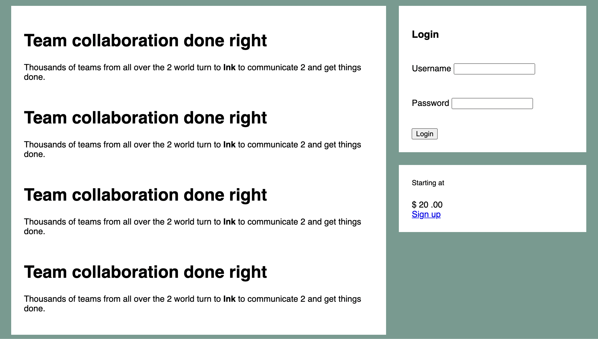
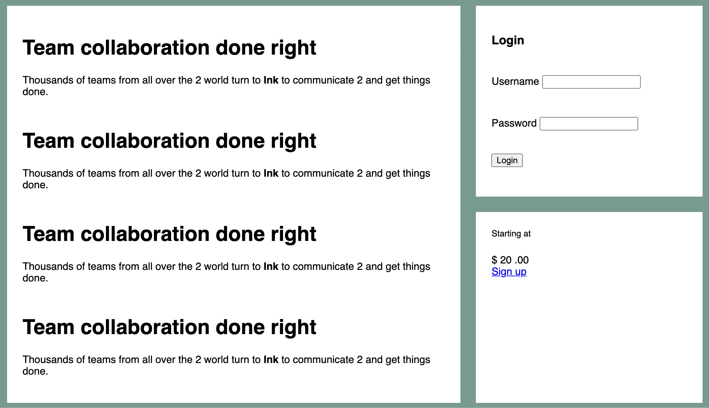

# Listing-5.9

現在は下記の構造の HTML に対して、`.flex` 要素をフレックスコンテのデフォルト設定を採用した状態で使用している状態である。

```html
<main class="flex">
  <div class="column-main tile"></div>

  <div class="column-sidebar">
    <div class="tile"></div>
    <div class="tile centered"></div>
  </div>
</main>
```

この状態の場合、下記のようにメインコンテンツの中身が増えてカラムの高さが増えてくると、サイドバーは同じ高さのフレックスアイテムを使用しているにもかかわらず、サイドバーの内側のコンテンツがカラムを満たすように拡大されていないことがわかる。



そこでサイドバー自体をフレックスコンテナとして、フレックスアイテムを縦方向に並べて、各アイテムがフレックスコンテナの余白を埋めるように拡大するような設定を追加する。

```css
.column-sidebar {
  flex: 1;

  display: flex;
  flex-direction: column;
}

.column-sidebar > .tile {
  flex: 1;
}
```

これで下記のようにフレックスコンテナの余白を埋めるために、フレックスアイテムが拡大していることがわかる。つまり、`flex-basis` などのプロパティが幅ではなく、高さに対して効いていることがわかる。


