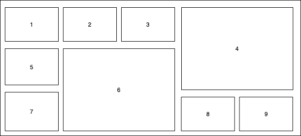

# Listing-6.1

CSS グリッドでは、列と行の 2 次元的なレイアウトを柔軟に定義することが可能であり、下記のように複数の行や列に跨るものを配置したり、空いている隙間を自然と埋めるような配置にすることも可能である。



グリッドレイアウトは、フレックスボックスと異なり 2017 年 3 月に発表されてから一気に主要ブラウザに広がり、3 ヶ月間でブラウザサポートは 70%まで到達した。

またグリッドレイアウトの仕様レベルはレベル 1 で安定しているため、本番環境で利用することも可能である。

> なお Internet Explorer では、`-ms-` プレフィックスを使用することで、IE10 と IE11 で利用可能となっている。

では以下の HTML をベースに 2 行 3 列のレイアウトを作成する。

```html
<div class="grid">
  <div class="a">a</div>
  <div class="b">b</div>
  <div class="c">c</div>
  <div class="d">d</div>
  <div class="e">e</div>
  <div class="f">f</div>
</div>
```

なおこの状態では以下のように縦並べで各アイテムが表示されているだけである。


